* Table of Contents
{:toc}

--------------------------------------------------------------------------------------------------------------------
## Introduction

GradPad is an offline computer application meant to help Computer Science students from the
National University of Singapore (NUS) plan their modules with more ease. All module information is
displayed through our simple and organised Graphical User Interface (GUI). GradPad is also optimised 
for users who prefer working on a Command Line Interface (CLI).

The objectives of the application include:

1. Allowing NUS CS students to track their degree progress.
2. Allowing NUS CS students to plan their modules for upcoming semesters.
3. Providing a fast and convenient way to view NUS CS module details.

--------------------------------------------------------------------------------------------------------------------
## About this Guide

This is a Developer Guide written for developers who wish to contribute to or extend
our GradPad Project. The guide will explain the different components that make up GradPad
and how these components come together to implement GradPad.

--------------------------------------------------------------------------------------------------------------------

## **Setting up, getting started**

Refer to the guide [_Setting up and getting started_](SettingUp.md).

--------------------------------------------------------------------------------------------------------------------

## **Design**

### Architecture

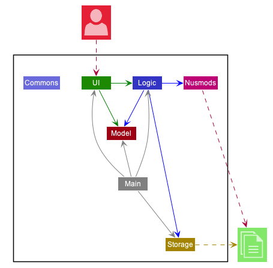

The ***Architecture Diagram*** given above explains the high-level design of the App. Given below is a quick overview of each component.

:bulb: **Tip:** The `.puml` files used to create diagrams in this document can be found in the [diagrams](https://github.com/AY2021S1-CS2103T-T09-1/tp/blob/master/docs/diagrams/) folder. Refer to the [_PlantUML Tutorial_ at se-edu/guides](https://se-education.org/guides/tutorials/plantUml.html) to learn how to create and edit diagrams.

**`Main`** has two classes called [`Main`](https://github.com/AY2021S1-CS2103T-T09-1/tp/blob/master/src/main/java/seedu/address/Main.java) and [`MainApp`](https://github.com/AY2021S1-CS2103T-T09-1/tp/blob/master/src/main/java/seedu/address/MainApp.java). It is responsible for,
* At app launch: Initializes the components in the correct sequence, and connects them up with each other.
* At shut down: Shuts down the components and invokes cleanup methods where necessary.

[**`Commons`**](#common-classes) represents a collection of classes used by multiple other components.

The rest of the App consists of five components.

* [**`UI`**](#ui-component): The UI of the App.
* [**`Logic`**](#logic-component): The command executor.
* [**`Model`**](#model-component): Holds the data of the App in memory.
* [**`Storage`**](#storage-component): Reads data from, and writes data to, the hard disk.
* [**`Nusmods`**](#nusmods-component): Reads data from the NUSMODS public API.

Each of the first four components,

* defines its *API* in an `interface` with the same name as the Component.
* exposes its functionality using a concrete `{Component Name}Manager` class (which implements the corresponding API `interface` mentioned in the previous point.

For example, the `Logic` component (see the class diagram given below) defines its API in the `Logic.java` interface and exposes its functionality using the `LogicManager.java` class which implements the `Logic` interface.

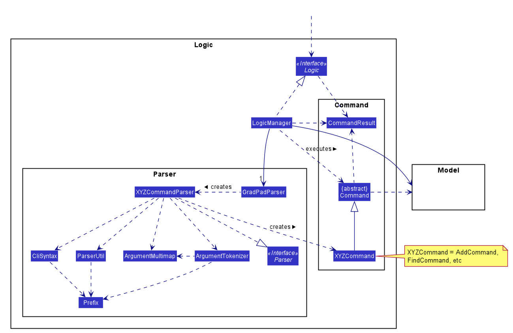

**How the architecture components interact with each other**

The *Sequence Diagram* below shows how the components interact with each other for the scenario where the user issues the command `delete 1`.

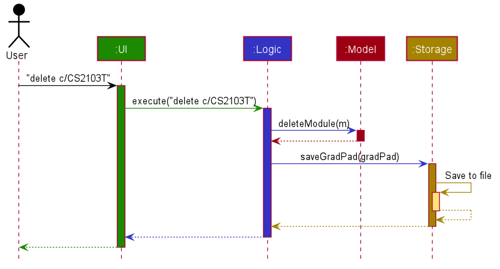

The sections below give more details of each component.

### UI component

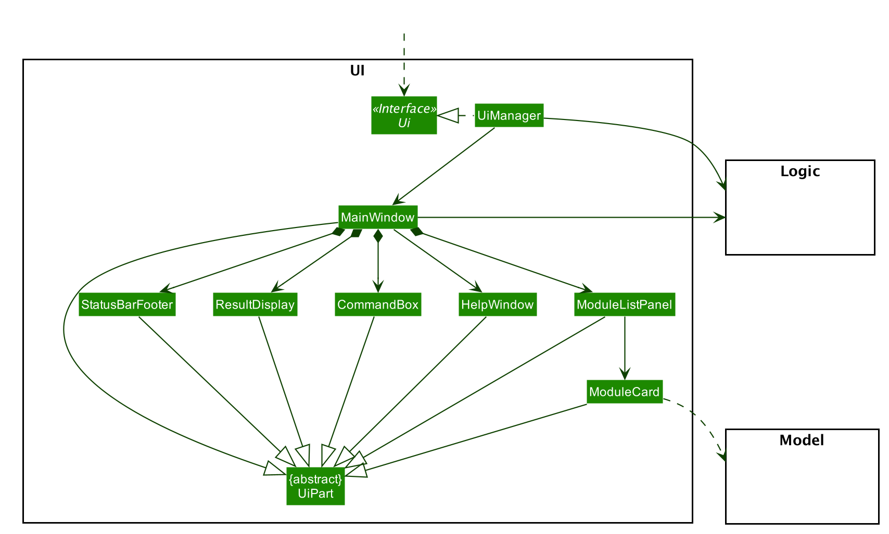

**API** :
[`Ui.java`](https://github.com/AY2021S1-CS2103T-T09-1/tp/blob/master/src/main/java/seedu/address/ui/Ui.java)

The UI consists of a `MainWindow` that is made up of parts e.g.`CommandBox`, `ResultDisplay`, `ModuleListPanel`, `StatusBarFooter` etc. All these, including the `MainWindow`, inherit from the abstract `UiPart` class.

The `UI` component uses JavaFx UI framework. The layout of these UI parts are defined in matching `.fxml` files that are in the `src/main/resources/view` folder. For example, the layout of the [`MainWindow`](https://github.com/AY2021S1-CS2103T-T09-1/tp/blob/master/src/main/java/seedu/address/ui/MainWindow.java) is specified in [`MainWindow.fxml`](https://github.com/AY2021S1-CS2103T-T09-1/tp/blob/master/src/main/resources/view/MainWindow.fxml)

The `UI` component,

* Executes user commands using the `Logic` component.
* Listens for changes to `Model` data so that the UI can be updated with the modified data.

### Logic component

**API** :
[`Logic.java`](https://github.com/AY2021S1-CS2103T-T09-1/tp/blob/master/src/main/java/seedu/address/logic/Logic.java)

1. `Logic` uses the `GradPadParser` class to parse the user command.
1. This results in a `Command` object which is executed by the `LogicManager`.
1. The command execution can affect the `Model` (e.g. adding a module).
1. The result of the command execution is encapsulated as a `CommandResult` object which is passed back to the `Ui`.
1. In addition, the `CommandResult` object can also instruct the `Ui` to perform certain actions, such as displaying help to the user.

Given below is the Sequence Diagram for interactions within the `Logic` component for the `execute("delete 1")` API call.

:information_source: **Note:** The lifeline for `DeleteCommandParser` should end at the destroy marker (X) but due to a limitation of PlantUML, the lifeline reaches the end of diagram.

### Model component

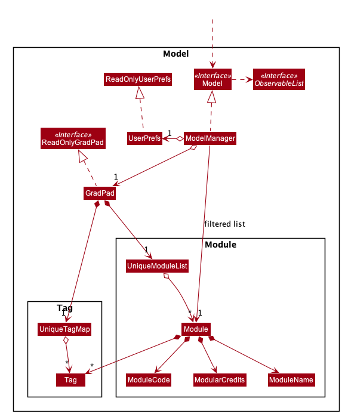

**API** : [`Model.java`](https://github.com/AY2021S1-CS2103T-T09-1/tp/blob/master/src/main/java/seedu/address/model/Model.java)

The `Model`,

* stores a `UserPref` object that represents the user’s preferences.
* stores the GradPad data.
* exposes an unmodifiable `ObservableList<Module>` that can be 'observed' e.g. the UI can be bound to this list so that the UI automatically updates when the data in the list change.
* does not depend on any of the other three components.

### Storage component

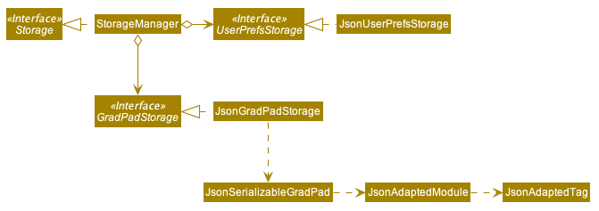

**API** : [`Storage.java`](https://github.com/AY2021S1-CS2103T-T09-1/tp/blob/master/src/main/java/seedu/address/storage/Storage.java)

The `Storage` component,
* can save `UserPref` objects in json format and read it back.
* can save the GradPad data in json format and read it back.
* stores required modules that are on the Computer Science curriculum, in the `RequiredCommandStorage` class.
* stores all General Education modules available in NUS, in the `GemCommandStorage` class.

### Design considerations

We chose to set up the module-specific Storage classes, with the sole purpose of extracting and parsing the JSON data
so that GradPad can interact with it.

### Rationale

This is done so that the `RequiredCommand`, `GemCommand` and `ScienceCommand` classes do not have to worry about
data retrieval and storage, such that they can focus on executing the command logic.

The two Storage classes are separated to avoid cluttering up `RequiredCommandStorage`, due to the hefty size of
General Education Modules.

### Nusmods component

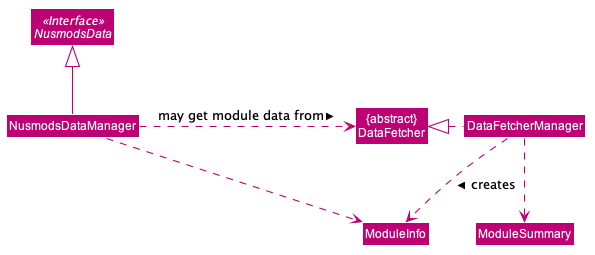

**API** : [`NusmodsData.java`](https://github.com/AY2021S1-CS2103T-T09-1/tp/blob/master/src/main/java/seedu/address/nusmods/NusmodsData.java)

The `Nusmods` component,
* can fetch module data from the NUSMODS public API.
* can save fetched module data in the form of `ModuleInfo` objects to a local JSON file.
* can provide module information based on a module code, in the form of `ModuleInfo` objects.

Critically, the component is able to fall back on reading pre-fetched module information from a local file when 
there's no internet connection.

#### Design considerations

We chose to split the `Nusmods` component into two main parts that have the following responsibilities respectively:
* Fetch module data - handled by `DataFetcher`
* Allow other GradPad components to access module data - handled by `NusmodsData`

##### Rationale

We chose to do this instead of clumping all the logic together to achieve better encapsulation and abstraction.
With this, the `NusmodsData` class only needs to be concerned with reading available module data, processing it,
and serving it up to the code who requested it. It doesn't need to care about how the data got there. 
That's the job of the `DataFetcher` class. As such, it is easy for us to swap out `DataFetcher`, or change its 
implementation without the need to touch the public interface provided by `NusmodsData`. This will prove to be 
useful when, for example, the NUSMODS API becomes obsolete, and we need to use another API, or if the NUSMODS 
API changes, and we need to redesign how we fetch data from it.

### Common classes

Classes used by multiple components are in the `seedu.addressbook.commons` package.

--------------------------------------------------------------------------------------------------------------------

## **Implementation**

This section describes some noteworthy details on how certain features are implemented.

### Nusmods feature
GradPad is tightly integrated with the NUSMods public API by using it to retrieve NUS module information to display
to users. More specifically, GradPad can perform the following operations:

* Retrieve information about a single module via the `/modules` API endpoint
* Retrieve a list of all NUS modules via the `/moduleList` API endpoint
* Store retrieved module information data from the aforementioned endpoints as local JSON files
* Read pre-fetched module information from local JSON files

The last 2 operations are crucial to allow GradPad to operate even without an internet connection. This will
be elaborated further below.

#### How a single module's data is retrieved (when connected to the internet)
GradPad uses the `ModuleInfo` class to represent module information received from NUSMods. Besides storing the various
schema fields in the API's JSON response as plain old Java objects (POJOs), it also handles the massaging of these
fields when they are read. 
For e.g. the raw numerical semesters "3" and "4" must be mapped to "Special Term I" and "Special Term II" when read.

This is the flow of logic when a single module's data is fetched via the API:

1. Some client code calls the `getModuleInfo` method in the `NusmodsDataManager` class and passes in a 
module code as a string parameter.

2. `getModuleInfo` calls the `fetchModuleInfo` method in the `DataFetcherManager` class.

3. `fetchModuleInfo` then makes a HTTP GET request to the NUSMods `/modules` endpoint via the `makeGETRequest`
utility method defined within the `HttpUtil` class. It also specifies the module code of the module it wants to fetch.

4. The `makeGETRequest` method returns the HTTP response as a string. In this case, the response returned is a 
JSON string. 

5. `fetchModuleInfo` then parses this JSON string into a `ModuleInfo` object.

Note: GradPad sets a 3s second timeout for all HTTP GET requests made. Adjust this where necessary.

The following sequence diagram illustrates this flow:

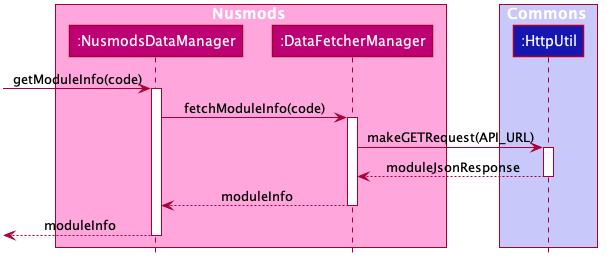

#### How a single module's data is retrieved (when disconnected from the internet)
Without an internet connection, GradPad clearly cannot retrieve module information via HTTP requests. Instead,
GradPad provides a fallback by including pre-fetched CS curriculum modules in each app release. This is a compromise
we choose to take. While pre-fetched data implies that it might not be up-to-date, we feel that this is better than
completely disallowing users from using GradPad without an internet connection. On top of this, we only choose
to pre-fetch CS curriculum modules as scraping and saving all 5800+ NUS modules means we'll have to make ungraceful
API requests and bloat our releases. It is also not scalable in any way.

This is the flow of logic when a single module's data is retrieved without an internet collection:

1. Some client code calls the `getModuleInfo` method in the `NusmodsDataManager` class and passes in a 
module code as a string parameter.

2. `getModuleInfo` calls the `fetchModuleInfo` method in the `DataFetcherManager` class. However, as there is no
 internet connection, this method call will fail with an exception.

3. Catching this, `getModuleInfo` proceeds to call the `getModuleInfoFromFile` method within the same class instead.

4. `getModuleInfoFromFile` then retrieves the local JSON file containing the module's information, reads it, and
parses it into a `ModuleInfo` object.

The following sequence diagram illustrates this flow:

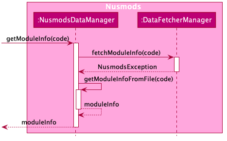

#### How module data is scraped and saved locally
As explained in the previous section, GradPad is able to access pre-fetched module information stored as local
JSON files. This section will explain the script used to scrape and save the 100+ CS curriculum modules that runs 
before shipping out GradPad releases.

This is the script's flow of logic:
1. The entry point of this flow is the `fetchAndSaveModules` method within the `DataFetcherManager` class. 

2. `fetchAndSaveModules` starts by fetching a list of all modules from the `/moduleList` API endpoint via a call
to the `fetchModuleSummaryList` method.

3. `fetchModuleSummaryList` makes the HTTP GET request and parses the JSON string response into a list of
 `ModuleSummary`
objects. 

4. This list of `ModuleSummary` objects are then filtered to remove all non-CS curriculum modules by passing it through
the `filterModuleSummaries` method.

5. Now that this list only contains `ModuleSummary` objects related to the CS curriculum, it is then passed to the
`generateModuleInfoMap` method.

6. `generateModuleInfoMap`'s main job is to create a map of module codes to `ModuleInfo` objects so that GradPad can 
easily retrieve `ModuleInfo` objects given a module code. It does this by 
iterating through every `ModuleSummary`, and fetching that module's module information from the `/modules` endpoint.
It then parses each module's information into a `ModuleInfo` object and puts it in a hashmap.

7. After this map is populated, it is then serialized and saved into a local JSON file.

Note: GradPad rate-limits step 6 with a 100ms delay between successive hits to the `/modules` endpoint. Adjust where
necessary.

The following sequence diagram illustrates this flow:

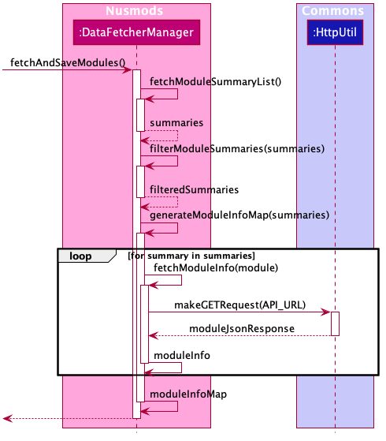

### Command Stalling feature

GradPad stalls certain commands that erase data so that users can provide confirmation as to
whether or not they wish to proceed with the commands. This feature relies heavily on each commands' `requiresStall()` method.

This is the general flow of logic when handling commands:

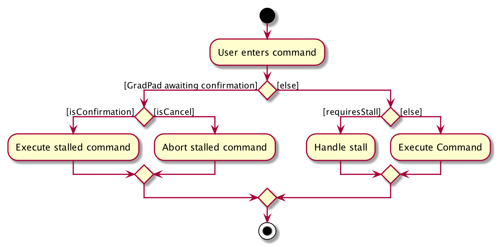

1. If a command `requiresStall`, `LogicManager` will self-invoke its `handleStall()` to store the command to be stalled.

2. `handleStall()` will then return a `CommandResult` which prompts the user for a confirmation.

The following sequence diagram illustrates this flow:

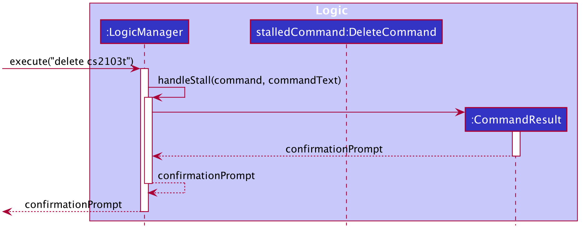

If the user provides a `YesCommand`, the `stalledCommand` is executed.

The following sequence diagram illustrates this flow:

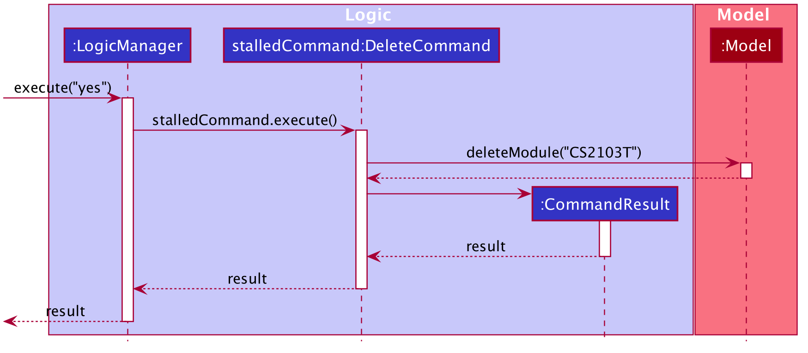

However, if the user does not provide a `YesCommand`, the stalledCommand will be set to null, after which an abort message will be displayed.

The following sequence diagram illustrates this flow:

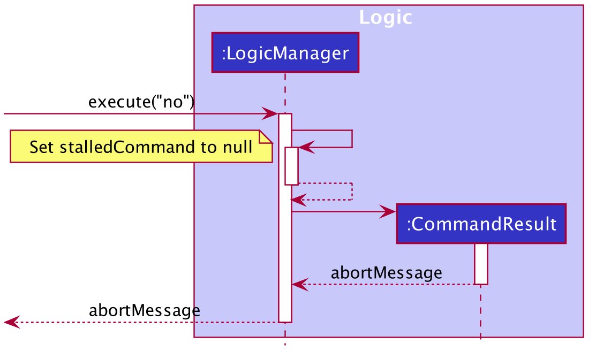

### Add feature
GradPad allows users to add modules to their list.

The following fields of a module are required (* for optional):
* Module Code
* Tags*

As with all operations in GradPad, the `AddCommand` class handles the execution of add operations.
The `AddCommandParser` class helps to parse user's input before creating the correct add command.

Given below is how an add operation behaves at each step of its execution.

1. The user types in a command string corresponding to an add operation.

2. This calls the `execute` method of the `LogicManager` class. The user input is passed in as a string.

3. `Logic.execute()` then calls the `parseCommand` method of the `gradPadParser` class to parse the string input.

4. `gradPadParser.parseCommand()` sees that this is an add command, and so uses the `AddCommandParser` class to create a corresponding `AddCommand`, using the `AddCommandParser.parse()` method.

5. In `AddCommandParser.parse()`, the string input is first split into tokens, i.e. module code, tags, etc.

6. The `ModuleInfoSearcher.searchModule()` is then called to retrieve module information (module title, modular credits, etc.) from Nusmods.

7. Once the module information is retrieved, a new `Module` object is created from the module information and tags. It now stores the values that we want to add into our list.

8. Lastly, in the same method call, an `AddCommand` is created with the new populated `Module`, and is passed back to the `LogicManager` in step 2.

9. `Logic Manager` executes the newly created `AddCommand`.

10. Finally, the `Model` is then updated by adding the new `Module` object.

**Auto-Retrieval of Module Information**

GradPad's `add` feature supports auto retrieval of module information from NUSMods, mainly a module's title and modular credits.
This is to ensure that the modules added into GradPad are valid NUS modules, and the module information for each module is accurate.

The following sequence diagram shows how the add command is executed.

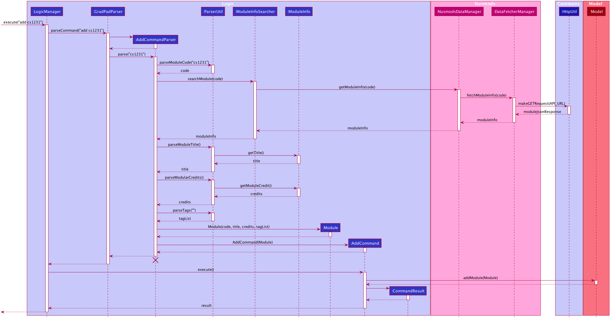

### Edit feature
GradPad allows users to edit modules that have already been added. 

The following fields of a module can be edited:
* Module Code
* Tags

As with all operations in GradPad, the `EditCommand` class handles the execution of edit operations.
The `EditCommandParser` class helps to parse a user's input before creating the correct edit command.

GradPad uses the `EditModuleDescriptor` class to facilitate edit operations. An `EditModuleDescriptor` is
a temporary bridge that holds the newly-edited fields of a module. You can set the `ModuleCode` and `Tags` of an `EditModuleDescriptor`,
whereas the `ModuleTitle` and `ModularCredits` of a module will be retrieved automatically via NUSMods. 
At least one field (`ModuleCode` or `Tags`) must be specified to successfully edit a module.

Given below is how an edit operation behaves at each step of its execution.

1. The user types in a command string corresponding to an edit operation.

2. This calls the `execute` method of the `LogicManager` class. The user input is passed in as a string.

3. `Logic.execute()` then calls the `parseCommand`  method of the `gradPadParser` class to parse the string input.

4. `gradPadParser.parseCommand()` sees that this is an edit command, and so uses the `EditCommandParser`
class to create a corresponding `EditCommand`.

5. In `EditCommandParser`, the string input is first split into tokens, i.e. new module code, new tags, etc.

6. The `ModuleInfoSearcher.searchModule()` is then called to retrieve module information (module title, modular credits, etc.) of the new module from Nusmods.

7. Once the module information is retrieved, an `EditModuleDescriptor` object is created from the module information and tags. It now stores
the new values that we want to update the target module with.

8. An `EditCommand` is then created with this populated `EditModuleDescriptor`, and is passed back to the
`LogicManager` in step 2.

9. `LogicManager` executes the newly created `EditCommand`.

10. The target module to be edited is retrieved. A copy of it is made and using the populated
 `EditModuleDescriptor`, the fields that are to be updated are replaced with their new values.
 
11. The `Model` is then updated by replacing the target module with its new updated copy.

**Auto-Retrieval of Module Information**

When a user wishes to edit the module code of a module, GradPad's `edit` feature supports auto retrieval of the new module information from NUSMods, mainly the module's title and modular credits.
This is to ensure that newly edited modules are valid NUS modules, and the module information for the edited module is accurate.

The following sequence diagram shows how the edit command is executed.

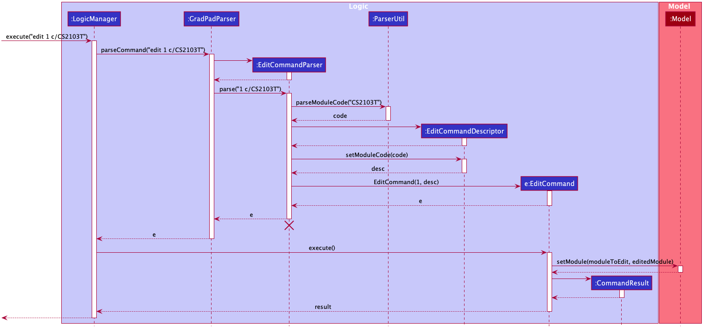

### Delete feature
GradPad allows users to delete modules that have already been added. 

As with all operations in GradPad, the `DeleteCommand` class handles the execution of delete operations.
The `DeleteCommandParser` class helps to parse a user's input before creating the correct delete command.

Given below is how a delete operation behaves at each step of its execution.

1. The user types in a command string corresponding to a delete operation.

2. This calls the `execute` method of the `LogicManager` class. The user input is passed in as a string.

3. `Logic.execute()` then calls the `parseCommand`  method of the `gradPadParser` class to parse the string input.

4. `gradPadParser.parseCommand()` sees that this is an delete command, and so uses the `DeleteCommandParser`
class to create a corresponding `DeleteCommand`, using the `DeleteCommandParser.parse()` method.

5. In `DeleteCommandParser`, the ModuleCode is first extracted from the string input. 

6. A `DeleteCommand` is then created with the ModuleCode, and is passed back to the
`LogicManager` in step 2.

7. `LogicManager` self-invokes its `handleStall()` method and returns a `CommandResult` which prompts the user for a confirmation.

8. When the user enters a `YesCommand`, `LogicManager` executes the stalled `DeleteCommand`.

9. The target module to be deleted is retrieved, if it exists in the Completed Modules of GradPad. 
 
10. The `Model` is then updated by removing the target module.

The following sequence diagram shows how the delete command is executed.

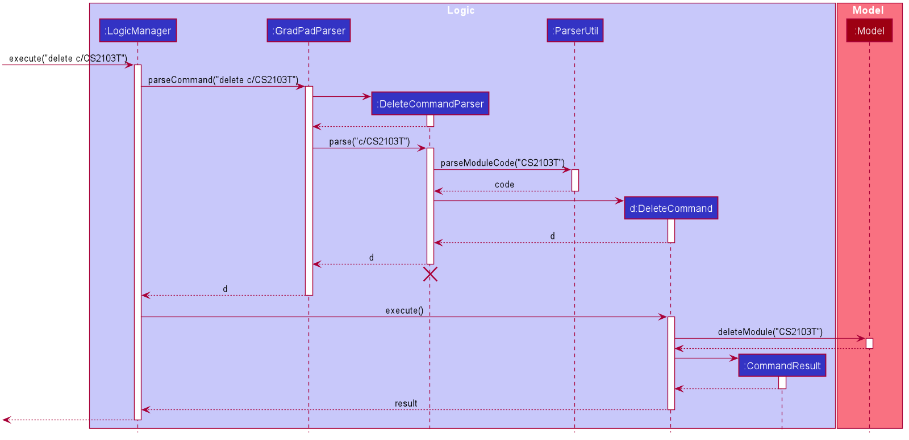

:information_source: **Note:** If the user performs a Force Delete Operation, 
the `LogicManager` will skip the part where it self-invokes its `handleStall()` method, and execute the command immediately.

### Find feature
GradPad allows users to find a specific module or a group of modules with common tags or sequence of characters. This feature is especially useful 
if there is a long list of modules currently in GradPad and users want to avoid the hassle of scrolling through the 
entire list to look for specific module(s). 

As with all operations in GradPad, the `FindCommand` class handles the execution of find operations.
The `FindCommandParser` class helps to parse a user's input before creating the correct find command.

Given below is a series of steps to show how a find operation behaves during its execution.

1. The user types in a command string corresponding to a find operation, e.g. "find cs foundation".

2. This calls the `execute` method of the `LogicManager` class. The user input is passed in as a string.

3. `Logic.execute()` then calls the `parseCommand`  method of the `GradPadParser` class to parse the string input.

4. `GradPadParser.parseCommand()` identifies the command as a find command, and thus uses the `FindCommandParser`
class to extract the string input as a list of keywords and create a `CompoundFindPredicate` with said list.

5. `CompoundFindPredicate` will test every keyword in the list against the logical union of both predicates 
`ModuleCodeContainsKeywordsPredicate` and `ModuleContainsTagsPredicate`, and returns the result.

6. A corresponding `FindCommand` will then be created using this `CompoundFindPredicate`.

5. This `FindCommand` is then passed back to the`LogicManager` in step 2.

6. `LogicManager` executes the newly created `FindCommand`.

7. `FindCommand.execute()` calls for `Model` to filter the GradPad list based on the given predicate(s).

8. Finally, a `CommandResult` is created and returned to show the result of the execution.

The following sequence diagram illustrates how the find command is executed.

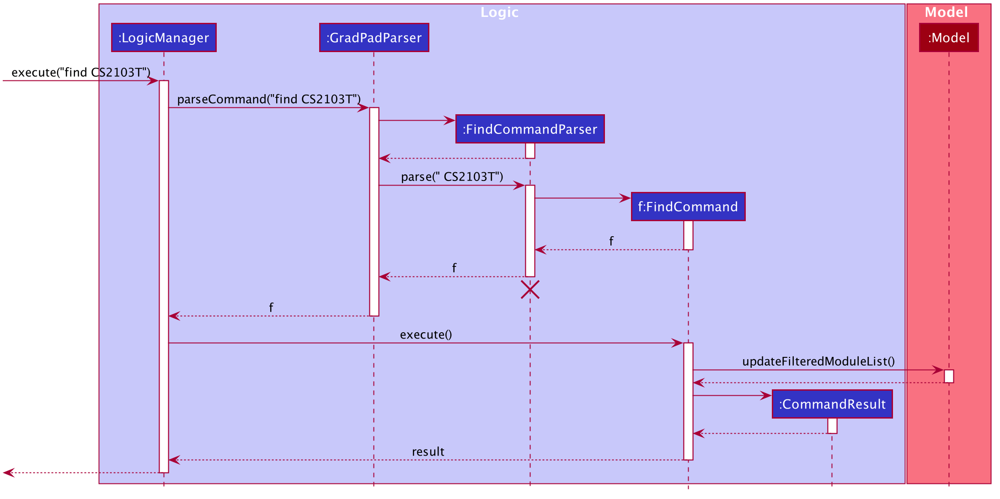

### List feature

The `list` command shows all modules that have been added by the user in the `Completed Modules` list.
This is needed as certain commands can change the modules that are being displayed. One such command is the
`find` command, which shows only matching modules in the list.

Before diving into how the `list` operation is executed, we must first gain a brief understanding of how the 
`Completed Modules` list displays its modules, and how this display can be changed by other commands.

The `Completed Modules` list is implemented by the `ModuleListPanel` UI class.
This class contains a list of modules, which comes from GradPad's `Model` component, that it uses to 
display to the user. To change the contents of the list, commands can apply filters to this list through `Model`.
For example, a command may ask `Model` to only show modules that have 4 modular credits.
When this happens, `Completed Modules` naturally changes the modules it displays too.

The following diagram illustrates this relationship:

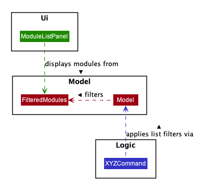

With this in mind, the aim of the `list` command is therefore to remove any existing filter on this module list,
effectively getting `Completed Modules` to display all modules once again.

Given below is a series of steps to show how a list operation behaves during its execution to achieve just this.

1. The user input is parsed and constructs a `ListCommand` object. (Implementation details of the parser are omitted
 here as they are not central in developing an understanding of the `list` operation)

2. When this command is executed, it calls the `updateFilteredModuleList` method in the `Model` class and passes in
a predicate that lets all modules through the filter.

3. The `Model` class updates its `filteredModules` list to include all modules as if it were unfiltered.

4. The `ModuleListPanel` UI component listens to changes in `filteredModules` and updates whenever the list is updated.
It thus updates to display all modules too.

The following sequence diagram illustrates how the list command is executed.

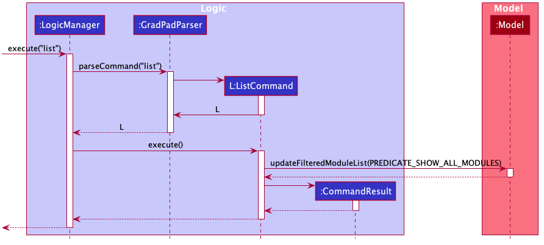

### CheckMc feature

The `checkmc` command allows users to view a tally of the total no. of modular credits from the modules present 
in the `Completed Modules` list.

As with all operations in GradPad, the `CheckMcCommand` class handles the execution of `checkmc` operations.
In brief, it works by going through all modules in the `Completed Modules` list and summing up each module's
modular credits.

Given below is a series of steps to show how a `checkmc` operation behaves during its execution.

1. The user enters the `checkmc` command string.

2. This calls the `execute` method of the `LogicManager` class with the user input passed in as a string.

3. `Logic.execute()` then calls the `parseCommand`  method of the `GradPadParser` class to parse the string input.

4. `GradPadParser.parseCommand()` identifies the command as a checkmc command and thus creates a `CheckMcCommand`
object.

5. This command object is then passed back to the `LogicManager` in step 2.

6. `LogicManager` executes the newly created `CheckMcCommand`.

7. `CheckMcCommand.execute()` retrieves the `GradPad` object stored within `Model` and accesses the `modules` field
within the `GradPad`.

8. It then loops through `modules`, which is a list of `Module` objects, and sums up all their modular credits.

8. Finally, a `CommandResult` is created to show the total no. of modular credits calculated.

The following sequence diagram illustrates how the `checkmc` command is executed.

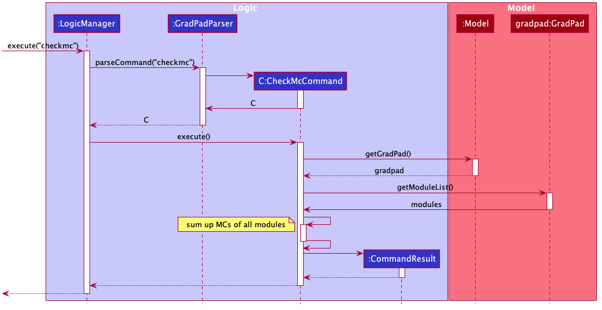

### Check required modules feature

The `required` command allows users to view the required modules in the NUS Computer Science curriculum 
that they have yet to take.

When the command is executed, it checks through the current modules in the `Completed Modules` list and ensures
that modules that have already been taken are not displayed in the list of remaining required modules.

This is achieved with the `RequiredCommand` and `RequiredCommandStorage` class. The `RequiredCommandStorage` class
handles the extracting, parsing of JSON module data while the `RequiredCommand` handles the logic
behind filtering the undone modules.

As with all operations in GradPad, the `RequiredCommand` class handles the execution of `required` operations.

Given below is a series of steps to show how a `required` operation behaves during its execution.

1. The user enters the `required` command string.

2. This calls the `execute` method of the `LogicManager` class with the user input passed in as a string.

3. `Logic.execute()` then calls the `parseCommand`  method of the `GradPadParser` class to parse the string input.

4. `GradPadParser.parseCommand()` identifies the command as a required command and thus creates a `RequiredCommand`
object.

5. This command object is then passed back to the `LogicManager` in step 2.

6. `LogicManager` executes the newly created `RequiredCommand`, which will contain the following uninitialised attributes,
list of `currentModules` in GradPad, all the `leftOverModules` and a `RequiredCommandStorage` to store all modules
in the syllabus.

7. Then, `RequiredCommand.execute()` retrieves the `GradPad` object stored within `Model` and accesses the `modules
` field within the `GradPad` with a few method calls, before storing it in `currentModules`.

8. `RequiredCommand.execute()` then calls its own method `setStorage` to create a `RequiredCommandStorage` object.

9. Within the `setStorage` method, various method calls are made for each module category (Eg. Foundation, IT Professionalism)
 to set up the `RequiredCommandStorage` object with the all the relevant modules.

10. Then, `RequireCommand.execute()` call its own method `compareAllGEs()` to check if any GE pillars have not been cleared.
It then keeps track of which pillars have not been cleared.

11. `RequireCommand.execute()` then proceeds to call its own methods `compareModules`, `compareScience` and `compareInternship`
to keep track of undone modules by cross-referring to the `currentModules` list.

12. Finally, a `CommandResult` is created with the `leftOverModules` to show the filtered list of remaining required modules.

The following sequence diagram illustrates how the `required` command is executed.

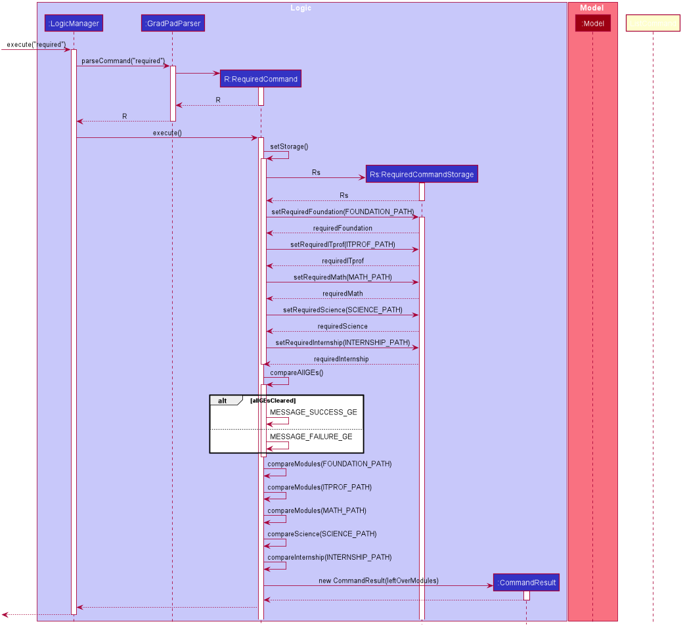

### Check all available Science Modules

The `science` command allows users to view all available Science modules available on the Computer Science curriculum.

When the command is executed, a list of all available Science modules will be displayed on the `Result Display`.

This is achieved by tapping into the `RequiredCommandStorage` class to extract and parse the Science modules, while the
`ScienceCommand` class handles the logic of displaying the modules. This command is separated from the `required`
command to avoid cluttering of the `Result Display`. 

As with all operations in GradPad, the `ScienceCommand` class handles the execution of `science` operations.

Given below is a series of steps to show how a `science` operation behaves during its execution.

1. The user enters the `science` command string.

2. This calls the `execute` method of the `LogicManager` class with the user input passed in as a string.

3. `Logic.execute()` then calls the `parseCommand`  method of the `GradPadParser` class to parse the string input.

4. `GradPadParser.parseCommand()` identifies the command as a science command and thus creates a `ScienceCommand`
object.

5. This command object is then passed back to the `LogicManager` in step 2.

6. `LogicManager` executes the newly created `ScienceCommand`, which will contain an empty list of `scienceModules`,
to be filled up by fetching a `RequiredCommandStorage` object.

7. Then, the `ScienceCommand.execute()` calls its own method, `setScienceModules()` which creates a
`RequiredCommandStorage` object.

8. Inside the `setScienceModules()` method, the `setRequiredScience` method of the `RequiredCommandStorage` class
is invoked, which sets `scienceModules` with the list of available Science modules.

9. Then, `ScienceCommand.execute()` calls for `Model` to filter out all existing Science modules in GradPad from
`scienceModules`, via the `hasModule()` method.

10. Finally, a `CommandResult` is created with the `filteredScienceModules` to display the modules.

The following sequence diagram illustrates how the `science` command is executed.

### Check all available General Education Modules

The `gem` command allows users to view all available General Education (GE) modules available in NUS.

When the command is executed, a list of all available GE modules will be displayed on the `Result Display`.

This is achieved with the `GemCommand` and `GemCommandStorage` class. The `GemCommandStorage` class
handles the extracting and parsing of JSON module data while the `GemCommand` handles the logic of displaying the
modules. This command is separated from `required` to avoid cluttering up the `Result Display` due to the hefty
amount of GE modules displayed.

As with all operations in GradPad, the `GemCommand` class handles the execution of `gem` operations.

Given below is a series of steps to show how a `gem` operation behaves during its execution.

1. The user enters the `gem` command string.

2. This calls the `execute` method of the `LogicManager` class with the user input passed in as a string.

3. `Logic.execute()` then calls the `parseCommand`  method of the `GradPadParser` class to parse the string input.

4. `GradPadParser.parseCommand()` identifies the command as a gem command and thus creates a `GemCommand`
object.

5. This command object is then passed back to the `LogicManager` in step 2.

6. `LogicManager` executes the newly created `GemCommand`, which will contain 2  uninitialised
`GemCommandStorage` attributes, used to store Semester 1 and 2 General Education Modules.

7. `GemCommand.execute()` then calls its own method `setSem1Storage` and `setSem2Storage` to create 2 `GemCommandStorage`
objects.

8. Within the `setSem1Storage` and `setSem2Storage` methods, various method calls are made for each GE pillar (Eg. GET, GER)
to set up the `sem1Storage` and `sem2Storage` objects with the all the relevant `sem1GeModules` and `sem2GeModules`.

9. Then, `GemCommand.execute()` calls for `Model` to filter out all existing GE modules in GradPad from both
`sem1GeModules` and `sem2GeModules`, via the `hasModule()` method.

10. Finally, a `CommandResult` is created with all the filtered GE modules, displaying all the available
GE modules by Semester.

The following sequence diagram illustrates how the `gem` command is executed.

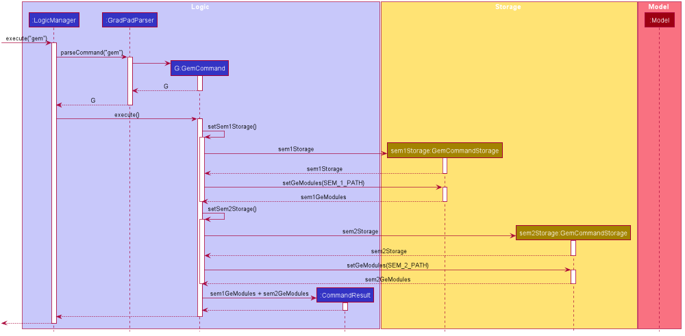

### Search feature

The `search` command allows users to search for any module available in NUS and display the module details.

To retrieve a module's information, the execution of this command interacts with the `Nusmods` component, which
contains all logic related to the access of module data from the NUSMODS public API. We will not go into detail
about the component here as we are mainly focused on the implementation of the search functionality.

As with all operations in GradPad, the `SearchCommand` class handles the execution of `search` operations.

Given below is a series of steps to show how a `search` operation behaves during its execution.

1. The user enters a search command string containing a module code, e.g. "search CS2103T".

2. This calls the `execute` method of the `LogicManager` class with the user input passed in as a string.

3. `Logic.execute()` then calls the `parseCommand`  method of the `GradPadParser` class to parse the string input.

4. `GradPadParser.parseCommand()` sees that this is a search command, and so uses the `SearchCommandParser.parse()` 
method in `SearchCommandParser`.

5. In `SearchCommandParser`, `SearchCommandParser.parse()` extracts the ModuleCode from the string input.

6. A `SearchCommand` is then created with the ModuleCode, and is passed back to the
`LogicManager` in step 2. 

7. `LogicManager` executes the newly created `SearchCommand`.

8. `SearchCommand.execute()` then creates an instance of `ModuleInfoSearcher` to call the `searchModule()` method by
passing in the module code.

9. `searchModule()` method will then take in the module code and retrieve the `ModuleInfo` by calling
`NusmodsData.getModuleInfo()` in the `Nusmods` package.

10. The `ModuleInfo` of the searched module retrieved will then be accessed and formatted according to the display 
requirement.

11. Finally, a `CommandResult` is created to display the module information that has been retrieved.

The following sequence diagram illustrates how the `search CS2103T` command is executed.

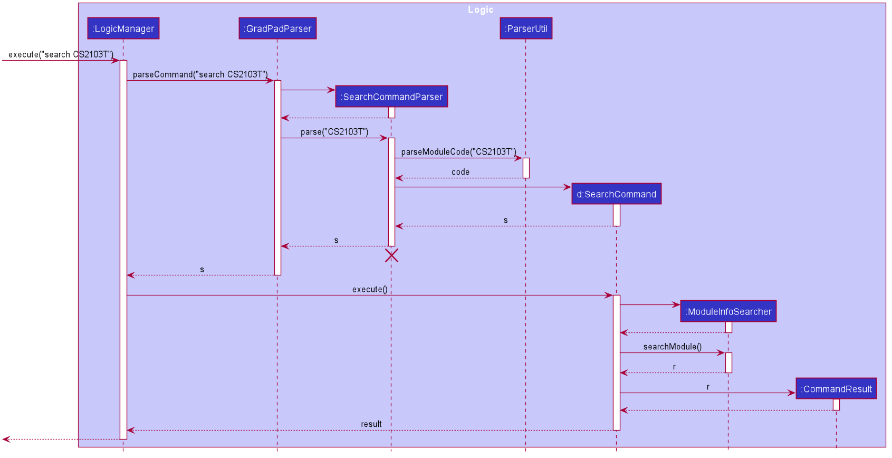

### Tags feature

GradPad allows users to add tags to modules that they add, remove tags from existing modules, list out all
existing tags in GradPad, and filter the `Completed Modules` list by tags.

Tags are represented by `Tag` objects which are referenced by `Module` objects when modules are tagged. 

To prevent duplicate tags from being created everytime a module is tagged (as was the case in the original AB3),
the `GradPad` class uses a `UniqueTagMap` class to keep track of a collection of unique `Tag` objects. With this,
when a user tags a module with an existing tag, `UniqueTagMap` looks for the existing `Tag` object and adds it to
that `Module` object. As such, all modules who use a particular tag now reference that corresponding singular `Tag
` object.

The main benefit of this is evident when GradPad needs to print out a list of all tags, which can be simply done
by printing out `UniqueTagMap`'s tags. Otherwise, one would have to iterate through all `Module` objects,
retrieve all their tags, and then filter them to remove any duplicates.

Following this, `UniqueTagMap` also has to handle the addition and deletion of modules, which is utilized by 
the `GradPad` class's add, edit, and delete operations for modules.

#### Adding a module with tags

1. When a module with tags is going to be added, the `GradPad` class within the `Model` component is passed that newly
 constructed `Module` object from the `Logic` component (see [add feature](#add-feature)).

2. Its `addModule` method is invoked with this object as a parameter.

3. Before adding this module to its list of modules, this new module's tags will first be parsed and replaced with
existing tags where possible. This is done using the`checkAndReplaceTags` method in the `UniqueTagMap` class.

4. The `checkAndReplaceTags` method basically loops through a list of `Tag` objects and checks each one against
the collection of existing `Tag` objects it already holds. If it comes across a "new" `Tag` that already exists
within its collection of tags, it replaces that "new" `Tag` with its existing equivalent `Tag` object in the list.
Otherwise, it adds genuinely new `Tag` objects to its collection.

5. Now that the new `Module` object's tags have been checked and replaced, the model adds this `Module` to its
`UniqueModuleList`.

The following diagram illustrates this flow of logic.

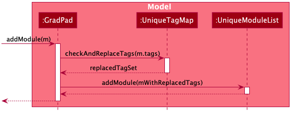

#### Deleting a module with tags

When a module is being deleted, its `Tag` objects within cannot simply be deleted, since multiple
`Module`s may share the same `Tag` object. Yet at the same time, when a `Tag` is no longer referenced by any `Module`,
it should be removed so that it doesn't loiter around in `UniqueTagMap`. To achieve this, `Tag` objects
store a count of the no. of modules that are currently using it. When this count hits 0, the `Tag` can be safely
 removed.
 
This is the execution flow when a module is deleted:

1. The `removeModule` method in the `GradPad` class is invoked.

2. The `remove` method in `UniqueTagMap` is then invoked with a set of all `Tag` objects belonging to the `Module` that
is to be removed.

3. Within the `remove` method, each `Tag`'s module count is decremented. If the count reaches 0 at this point,
then the `Tag` must be unused by all modules. It is thus removed from the collection of `Tag`s within
`UniqueTagMap`.

4. The `Module` object can now be deleted from the `UniqueModuleList` in the `GradPad` class.

The diagram illustrates this flow of logic:

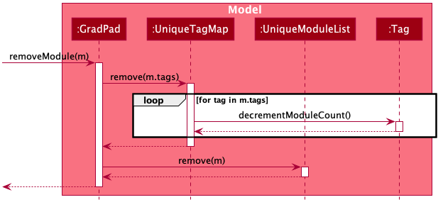

#### Editing a module's tags

When editing a module's tags, the old tags are simply "removed" as when 
[a module is deleted](#deleting-a-module-with-tags), followed by "adding" the new tags, as when
[a module is added](#adding-a-module-with-tags).

### \[Proposed\] Undo/redo feature

#### Proposed Implementation

The proposed undo/redo mechanism is facilitated by `VersionedGradPad`. It extends `GradPad` with an undo/redo history,
stored internally as a `gradPadStateList` and `currentStatePointer`. Additionally, it implements the 
following operations:

* `VersionedGradPad.commit()` — Saves the current GradPad state in its history.
* `VersionedGradPad.undo()` — Restores the previous GradPad state from its history.
* `VersionedGradPad.redo()` — Restores a previously undone GradPad state from its history.

These operations are exposed in the `Model` interface as `Model.commitGradPad()`, `Model.undoGradPad()` 
and `Model.redoGradPad()` respectively.

Given below is an example usage scenario and how the undo/redo mechanism behaves at each step.

Step 1. The user launches the application for the first time. The `VersionedGradPad` will be initialized with 
the initial GradPad state, and the `currentStatePointer` pointing to that single GradPad state.

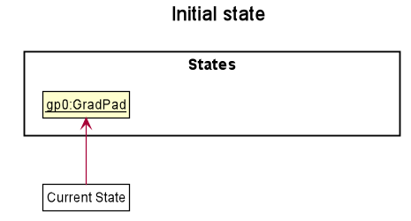

Step 2. The user executes `delete CS2103T` command to delete the `CS2103T` Module from the Completed Modules. The 
`delete` command calls `Model.commitGradPad()`, causing the modified state of the GradPad after the `delete CS2103T` 
command executes to be saved in the `gradPadStateList`, and the `currentStatePointer` is shifted to the newly inserted 
GradPad state.

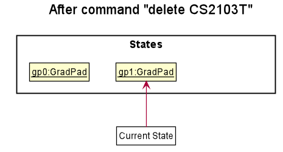

Step 3. The user executes `add CS2100` to add a new module. The `add` command also calls `Model.commitGradPad()`, 
causing another modified GradPad state to be saved into the `gradPadStateList`.

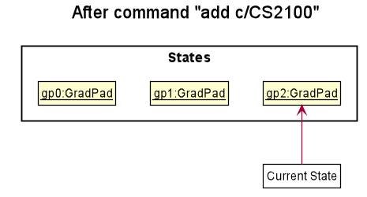

:information_source: **Note:** If a command fails its execution, it 
will not call `Model.commitGradPad()`, so the GradPad state will not be saved into the `gradPadStateList`.

Step 4. The user now decides that adding the module was a mistake, and decides to undo that action by executing the 
`undo` command. The `undo` command will call `Model.undoGradPad()`, which will shift the `currentStatePointer` once 
to the left, pointing it to the previous GradPad state, and restores the GradPad to that state.

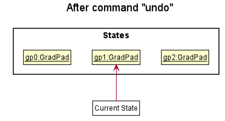

:information_source: **Note:** If the `currentStatePointer` is at index 
0, pointing to the initial GradPad state, then there are no previous GradPad states to restore. The `undo` command 
uses `Model.canUndoGradPad()` to check if this is the case. If so, it will return an error to the user rather
than attempting to perform the undo.

The following sequence diagram shows how the undo operation works:

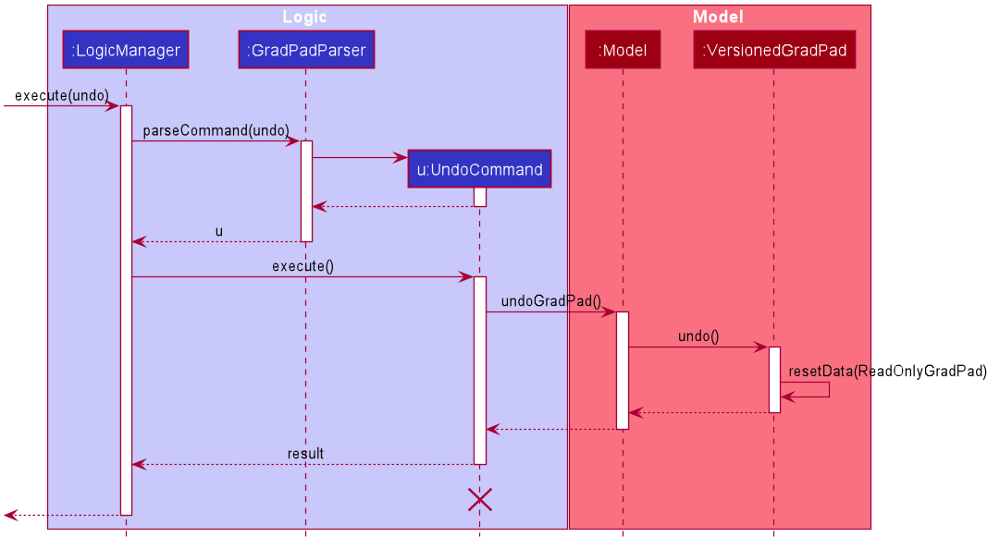

:information_source: **Note:** The lifeline for `UndoCommand` should 
end at the destroy marker (X) but due to a limitation of PlantUML, the lifeline reaches the end of diagram.

The `redo` command does the opposite — it calls `Model.redoGradPad()`, which shifts the `currentStatePointer` once 
to the right, pointing to the previously undone state, and restores the GradPad to that state.

:information_source: **Note:** If the `currentStatePointer` is at index 
`gradPadStateList.size() - 1`, pointing to the latest GradPad state, then there are no undone GradPad states to restore. 
The `redo` command uses `Model.canRedoGradPad()` to check if this is the case. If so, it will return an error to the 
user rather than attempting to perform the redo.

Step 5. The user then decides to execute the command `list`. Commands that do not modify the GradPad, such as `list`, 
will usually not call `Model.commitGradPad()`, `Model.undoGradPad()` or `Model.redoGradPad()`. Thus, the 
`gradPadStateList` remains unchanged.

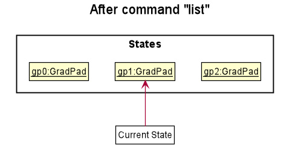

Step 6. The user executes `clear`, which calls `Model.commitGradPad()`. Since the `currentStatePointer` is not pointing 
at the end of the `gradPadStateList`, all GradPad states after the `currentStatePointer` will be purged. Reason: It no 
longer makes sense to redo the `add CS2100` command. This is the behavior that most modern desktop 
applications follow.

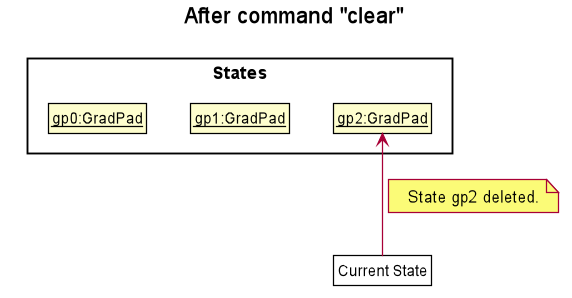

The following activity diagram summarizes what happens when a user executes a new command:

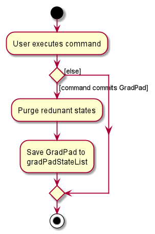

#### Design consideration:

##### Aspect: How undo & redo executes

* **Alternative 1 (current choice):** Saves the entire GradPad.
  * Pros: Easy to implement.
  * Cons: May have performance issues in terms of memory usage.

* **Alternative 2:** Individual command knows how to undo/redo by
  itself.
  * Pros: Will use less memory (e.g. for `delete`, just save the module being deleted).
  * Cons: We must ensure that the implementation of each individual command are correct.

--------------------------------------------------------------------------------------------------------------------

## **Documentation, logging, testing, configuration, dev-ops**

* [Documentation guide](Documentation.md)
* [Testing guide](Testing.md)
* [Logging guide](Logging.md)
* [Configuration guide](Configuration.md)
* [DevOps guide](DevOps.md)

--------------------------------------------------------------------------------------------------------------------

## **Appendix A: Requirements**

### Product scope

**Target user profile**:

Anybody → Students → University Students → tech savvy University student → Computer Science students
NUS Computer Science undergraduate students, who wish to keep track of their necessary modules (how many are done, how many are left), and also the total MCs tabulation.

**Value proposition**: 

Keep track of your degree progress and modules taken during your time in NUS with ease. Faster and more lightweight than traditional GUI applications, view and update your progress by issuing simple text commands. Modules are conveniently categorized into their respective groupings e.g. Unrestricted Electives, Computer Science Foundations, etc.

### User stories

Priorities: High (must have) - `* * *`, Medium (nice to have) - `* *`, Low (unlikely to have) - `*`

| Priority | As a …​                                    | I want to …​                     | So that I can…​                                                        |
| -------- | ------------------------------------------ | ------------------------------ | ---------------------------------------------------------------------- |
| `* * *`  | NUS Student                                | see my total Modular Credits   | know how many more I require to graduate                 |
| `* * *`  | NUS Student                                | see my past Modules            | know what I have taken before                                                                   |
| `* * *`  | user                                       | delete modules                 | remove entries that I no longer need                                 |
| `* * *`  | user                                       | add modules and MCs            | keep track of my Modular progress |
| `* *`    | first-time user                            | access the available commands  | use the app efficiently                |
| `* *`    | user                                     | save and load my Module data   | keep track of my Modular progress                                            |

### Use cases

(For all use cases below, the **System** is the `GradPad` and the **Actor** is the `user`, unless specified otherwise)

**Use case: UC01 - Delete a module from `Completed Modules`**

**MSS**

1.  User requests to delete a specific Module in the `Completed Modules`
2.  GradPad deletes the module
3.  GradPad displays the deleted module onto the `Result Display`

    Use case ends.

**Extensions**

* 1a. The module does not exist in `Completed Modules`.

    * 1a1. GradPad shows an error message.
    
        Use case ends.

* 2a. The given module code is invalid.

    * 2a1. GradPad shows an error message.

      Use case resumes at step 1.
      
**Use case : UC02 - Add a module into `Completed Modules`**

**MSS**

1. User requests to add a module into the `Completed Modules`
2. GradPad adds the module into `Completed Modules`
3. GradPad displays the module added onto the `Result Display`

    Use case ends.
    
**Extensions**
  
* 1a. The input command format is invalid.

    * 1a1. GradPad shows an error message.
    
      Use case ends.
      
* 1b. Module to be added does not exist in NUS.

    * 1b1. GradPad shows an error message.
    
      Use case ends.    
      
**Use case : UC03 - View help**

**MSS**

1. User requests to view help commands
2. GradPad shows a list of commands

    Use case ends.
    
**Use case : UC04 - View all `Completed Modules`**

**MSS**

1. User requests to view list of modules in `Completed Modules`
2. GradPad shows all modules added into `Completed Modules`

    Use case ends.
    
**Use case: UC05 - Edit a module in `Completed Modules`**

1. User requests to edit a module in `Completed Modules`
2. Module is replaced with updated fields
3. GradPad displays the module edited onto the `Result Display`
    
    Use case ends.

**Extensions**

* 1a. The module does not exist in `Completed Modules`.

    * 1a1. GradPad shows an error message.
    
        Use case ends.

* 1b. No field is edited for the module.

    * 1b1. GradPad shows an error message.
       
        Use case ends.
    
* 1c. Edited module does not exist in NUS.

    * 1c1. GradPad shows an error message.
    
        Use case ends.
    
        
* 1d. The input fields format is invalid.
    
    * 1d1. GradPad shows an error message.
        
        Use case ends.
        
**Use case : UC06 - Find modules in `Completed Modules`**

**MSS**

1. User requests to find modules in `Completed Modules` using keywords.
2. GradPad displays the modules found onto the `Result Display`

    Use case ends.
    
**Extensions**

* 1a. No modules or tag found.
    
    * 1a1. GradPad displays no modules found message onto `Result Display`.
    
        Use case ends.       

**Use case : UC07 - View required modules in CS curriculum**

**MSS**

1. User requests to view all required modules in CS curriculum
2. GradPad displays the required modules in CS curriculum onto the `Result Display`

    Use case ends.
    
**Use case : UC08 - View all available General Education Modules offered in NUS**

**MSS**

1. User requests to view all available General Education Modules offered in NUS.
2. GradPad displays all available General Education modules onto the `Result Display`

    Use case ends.    

**Use case : UC09 - View all available Science modules in the CS curriculum**

**MSS**

1. User requests to view all available Science modules in the CS curriculum.
2. GradPad displays all available Science modules in the CS curriculum onto the `Result Display`

    Use case ends. 
    
  
**Use case : UC010 - Search for module details**

**MSS**

1. User requests to search for a module in NUS.
2. GradPad displays the module details in the `Result Display`

    Use case ends.
    
**Extensions**

* 1a. The module searched does not exist in NUS.

    * 1a1. GradPad shows an error message.
        
        Use case ends.              

**Use case : UC011 - Check total modular credits**

**MSS**

1. User requests to view total modular credits achieved.
2. GradPad displays the total modular credits in the `Result Display`

    Use case ends.

**Use case : UC12 - exit GradPad**

**MSS**

1. User requests to exit GradPad
2. GradPad exits

    Use case ends.

### Non-Functional Requirements

1.  Should work on any _mainstream OS_ as long as it has Java `11` or above installed.
2.  Should work on both 32-bit and 64-bit environments.
3.  Should be backwards compatible with data produced by earlier versions of the application.
4.  Should be able to hold up to 1000 modules without a noticeable sluggishness in performance for typical usage.
5.  A user with above average typing speed for regular English text (i.e. not code, not system admin commands) should be able to accomplish most of the tasks faster using commands than using the mouse.
6.  Should be able to respond within one seconds.
7.  Should be usable by a novice who has never done module tracking of any sort.
8.  The application is not required to handle module tracking by NUS students outside of the Computer Science major. 

*{More to be added}*

### Glossary

* **Mainstream OS**: Windows, Linux, Unix, OS-X
* **Module Code**: Each module of study has a unique module code consisting of a two- or three-letter prefix that generally denotes the discipline, and four digits.
   * **First digit**: Represents the level of the module, i.e., 1000 indicates a Level 1 module and 2000, a Level 2 module, etc.
   * **Second digit**: Indicates the type of module, i.e., 1 for essential, 2 for elective, 3 for enrichment.
* **Modular Credit (MC)**: A unit of the effort, stated in terms of time, expected of a typical student in managing his/her workload. The MC-value of a module is derived by dividing the estimated total number of workload hours per week for that module by the credit factor of 2.5 (i.e., one MC is equivalent to 2.5 hours of study and preparation per week).

*{More to be added}*

--------------------------------------------------------------------------------------------------------------------

## **Appendix B: Instructions for Manual Testing**

Given below are instructions to test the app manually.

:information_source: **Note:** These instructions only provide a starting point for testers to work on;
testers are expected to do more *exploratory* testing.

### Launch and Shutdown

1. Initial Launch

   1. Download the jar file and copy into an empty folder.
   
   1. Double-click the jar file. 
      Expected: GUI runs with a set of sample modules. The window size may not be optimum.

1. Saving Window Preferences

   1. Resize the window to an optimum size. Move the window to a different location. Close the window.

   1. Re-launch the app by double-clicking the jar file. 
       Expected: The most recent window size and location is retained.

1. Shutdown

   1. Test case: Click the "close" button (red button) at the top of the window. 
      Expected: The window closes immediately.
      
   1. Test case: `exit` 
      Expected: GUI shows a farewell message,"Exiting GradPad as requested ..." and delays for 1.5 seconds,
      after which the window closes.
      
   1. Test case: `exitt` 
      Expected: Window does not close. _Unknown command_ message is shown in the result display.

### Testing features

#### Add a Module

Prerequisites: 
   1. Module code must be specified.
   1. Module code format must be valid, e.g. 'CS2100' is a valid module code.
   1. Module to be added must exist in the valid modules list fetched from NUSMods, e.g. module code CS2100 is a
   valid module, whereas module code CS1000 is an invalid module.
   1. Module added must not already exist in GradPad.
   1. Command must follow the `add` format.

Test Cases:
1. Test case: `add cs2100 t/fun` 
   Expected: CS2100 module is added into 'Completed Modules' in GradPad. Details of the added module are shown in the result display.
   
1. Test case: `add cs2100` 
   Expected: No module added. _Duplicate module_ message is shown in the result display.

1. Test case: `add cs2100 t/funnn` 
   Expected: No module added. _Duplicate module_ message is shown in the result display.
   
1. Test case: `add cs2100 Computer Organisation` 
   Expected: No module added. _Invalid module code format_ message is shown in the result display.
      
1. Test case: `add cs1000` 
   Expected: No module added. _Invalid module_ message is shown in the result display.
      
1. Test case: `add` 
   Expected: No module added. _Invalid command format_ message is shown in the result display.
   
1. Test case: `addd cs2100` 
   Expected: No module added. _Unknown command_ message is shown in the result display.

#### Delete a Module

Prerequisites: 
   1. Module code must be specified.
   1. Module code format must be valid.
   1. Module to be deleted must exist in the list being displayed in GradPad, e.g. CS2100 is in the list and CS2106 is not.
   1. Command must follow the `delete` format, followed by `y`, `ye`, or `yes` formats for confirmation.
 
Test Cases:     
1. Test case: `delete cs2100` followed by `y` 
   Expected: CS2100 module is deleted from 'Completed Modules' in GradPad. _Confirmation_ message followed by
   details of the deleted module are shown in the result display.
   
1. Test case: `delete cs2100` followed by `n` 
   Expected: No module deleted. _Confirmation_ message followed by _Command aborted_ message are shown in the
   result display.
   
1. Test case: `delete cs2100 Computer Ogranisation` 
   Expected: No module deleted. _Invalid module code format_ message is shown in the result display.

1. Test case: `delete cs2106` 
   Expected: No module deleted. _Module not found_ message is shown in the result display.
      
1. Test case: `delete` 
   Expected: No module deleted. _Invalid command format_ message is shown in the result display.
   
1. Test case: `deleteee cs2100` 
   Expected: No module deleted. _Unknown command_ message is shown in the result display.
 
#### Force Delete a module

Prerequisites: 
   1. Module code must be specified.
   1. Module code format must be valid.
   1. Module to be deleted must exist in the list being displayed in GradPad, e.g. CS2100 is in the list and CS2106 is not.
   1. Command must follow the `fdelete` format.
 
Test Cases:     
1. Test case: `fdelete cs2100` 
   Expected: CS2100 module is deleted from 'Completed Modules' in GradPad. Details of the deleted module are shown
   in the result display.
   
1. Test case: `fdelete cs2100 Computer Ogranisation` 
   Expected: No module deleted. _Invalid module code format_ message is shown in the result display.

1. Test case: `fdelete cs2106` 
   Expected: No module deleted. _Module not found_ message is shown in the result display.
      
1. Test case: `fdelete` 
   Expected: No module deleted. _Invalid command format_ message is shown in the result display.
   
1. Test case: `fdeleteee cs2100` 
   Expected: No module deleted. _Unknown command_ message is shown in the result display.

#### Clear current list of Modules

Prerequisites:
   1. Command must follow the `clear` format followed by `y`, `ye`, or `yes` formats for confirmation.
   
Test Cases:
1. Test case: `clear` followed by `y` 
   Expected: All modules are cleared from GradPad. _Confirmation_ message followed by _GradPad cleared_ message
   are shown in the result display.
   
1. Test case: `clearrr`
   Expected: Modules are not cleared from GradPad. _Unknown command_ message is shown in the result display.
   
#### Force Clear current list of Modules

Prerequisites:
   1. Command must follow the `fclear` format.
   
Test Cases:
1. Test case: `fclear` 
   Expected: All modules are cleared from GradPad. _GradPad cleared_ message is shown in the result display.
   
1. Test case: `fclearrr`
   Expected: Modules are not cleared from GradPad. _Unknown command_ message is shown in the result display.

#### Edit a Module

Prerequisites:
   1. Module code of module to be edited must be specified.
   1. Module code format of module to be edited must be valid.
   1. Module to be edited must exist in the list being displayed in GradPad, e.g. CS2100 is in the list and CS2106 is not.
   1. Module replaced must be an existing module in NUS.
   1. At least 1 field to edit must be specified (module code/tags)
   1. Format of field to edit must be valid.
   1. Replaced fields must be different from current fields.
   1. Command must follow the `edit` format.
 
Test Cases:  
1. Test case: `edit cs2100 c/cs2103t` 
   Expected: CS2100 module is replaced with CS2103T. Details of the edited module are shown in the result display.
      
1. Test case: `edit cs2100 Computer Organisation c/cs2103t` 
   Expected: No module edited. _Invalid module code format_ message is shown in the result display.
      
1. Test case: `edit cs2106 c/cs2103t` 
   Expected: No module edited. _Module not found_ message is shown in the result display.
   
1. Test case: `edit cs2100 c/cs1000` 
   Expected: No module edited. _Invalid module_ message is shown in the result display.
   
1. Test case: `edit cs2100 c/cs2100s Computer Organisation II` 
   Expected: No module edited. _Invalid module code format_ message is shown in the result display.
   
1. Test case: `edit cs2100 c/cs2100` 
   Expected: No module edited. _Same module_ message is shown in the result display.
   
1. Test case: `edit cs2100 t/fun` 
   Expected: CS2100 module tag is replaced with "fun" tag. Details of the edited module are shown in the result display.
   
1. Test case: `edit cs2100 t/fun` 
   Expected: No module edited. _Same tag_ message is shown in the result display.

1. Test case: `edit cs2100 t/fun!!!` 
   Expected: No module edited. _Invalid tag format_ message is shown in the result display.
      
1. Test case: `edit` 
   Expected: No module edited. _Invalid command format_ message is shown in the result display.
  
1. Test case: `edittt cs2100 t/cool` 
   Expected: No module edited. _Unknown command_ message is shown in the result display.
      
#### List All Modules

Prerequisite: 
   1. Command must follow the `list` format.

Test Cases:
1. Test case: `list` 
   Expected: The full list of 'Completed Modules' is displayed. "Listed all modules" message shown in the result display.
   
1. Test case: `listttt` 
   Expected: Current list remains unchanged. _Unknown command_ message is shown in the result display.

#### Find a Specific Module or a Group of Modules

Prerequisites: 
   1. Arguments must be specified.
   1. Module to be included must exist in the 'Completed Modules' in GradPad, e.g. CS2100 (fun), CS2101 (fun),
   ST2334 (fun) and CS3230 are in the list and CS2106 is not. The words in the bracket represent the module tags.
   1. Command must follow the `find` format.

Test Cases:    
1. Test case: `find cs2` 
   Expected: CS2100 and CS2101 are displayed. "2 modules found!" message shown in the result display.
   
1. Test case: `find cs2 st` 
   Expected: CS2100, CS2101 and ST2334 are displayed. "3 modules found!" message shown in the result display.
   
1. Test case: `find cs3230` 
   Expected: CS3230 is displayed. "1 modules found!" message shown in the result display.

1. Test case: `find cs2106` 
   Expected: No modules displayed. "0 modules found!" message shown in the result display.
   
1. Test case: `find fu` 
   Expected: CS2100, CS2101 and ST2334 are displayed. "3 modules found!" message shown in the result display.

1. Test case: `find fun` 
   Expected: CS2100, CS2101 and ST2334 are displayed. "3 modules found!" message shown in the result display.
   
1. Test case: `find funnnn` 
   Expected: No modules displayed. "0 modules found!" message shown in the result display.  
      
1. Test case: `find` 
   Expected: Current list is unchanged. _Invalid command format_ message is shown in the result display.
   
1. Test case: `findd CS2101`  
   Expected: No modules displayed. _Unknown command_ message is shown in the result display.
   
#### Check Total Modular Credits

Prerequisite:
   1. Command must follow the `checkmc` format.

Test Cases:
1. Test case: `checkmc`  
   Expected: Total modular credits are calculated and displayed. If there are no modules in 'Completed Modules',
   total modular credits will be 0.
   
1. Test case: `checkmccccc`  
   Expected: Total modular credits are not calculated. _Unknown command_ message is shown in the result display.
   
#### Open Help Page

Prerequisite:
   1. Command must follow the `help` format.

Test Cases:
1. Test case: `help`  
   Expected: Help page is displayed.
   
1. Test case: `helppppp`  
   Expected: Help page is not displayed. _Unknown command_ message is shown in the result display.
   
#### Show Required Modules

Prerequisite:
   1. Command must follow the `required` format.

Test Cases:
1. Test case: `required`  
   Expected: All required modules are displayed in the result display. Modules already in the 'Completed Modules' list in GradPad would not be displayed in the 'Required Modules' list.
   
1. Test case: `requiredddd`  
   Expected: Required modules are not displayed. _Unknown command_ message is shown in the result display.
   
#### Show available Science Modules

Prerequisite:
   1. Command must follow the `science` format.

Test Cases:
1. Test case: `science`  
   Expected: All available Science modules are displayed in the result display. Modules already in the 'Completed Modules'
   list would not be displayed.
   
1. Test case: `scienceeeee`  
   Expected: Science modules are not displayed. _Unknown command_ message is shown in the result display.
   
#### Show available General Education Modules

Prerequisite: 
   1. Command must follow the `gem` format.

Test Cases:
1. Test case: `gem`  
   Expected: All available General Education modules are displayed in the result display. Modules already in the 'Completed Modules'
   list would not be displayed.
   
1. Test case: `gemmmmm`  
   Expected: General Education modules are not displayed. _Unknown command_ message is shown in the result display.

#### Search Module Information

Prerequisites: 
   1. Module code must be specified.
   1. Module code format must be valid.
   1. Module to be searched must exist in the valid modules list fetched from NUSMods,e.g. module code CS2100
   is a valid module, whereas module code CS1000 is an invalid module.
   1. Command must follow the `search` format.

Test Cases:
1. Test case: `search cs2100` 
   Expected: CS2100 module information is displayed in the result display.
   
1. Test case: `search cs2100 Computer Organisation` 
   Expected: No module information is displayed. _Invalid module code format_ message is shown in the result display.

1. Test case: `search cs1000` 
   Expected: No module information is displayed. _Invalid module_ message is shown in the result display.
      
1. Test case: `search` 
   Expected: No module information is displayed. _Invalid command format_ message is shown in the result display.

1. Other invalid search commands to try: `search c/cs2103t`, `search 1` 
   Expected: No module information is displayed. _Invalid module_ message is shown in the result display.
1. Test case: `searchh cs2100` 
   Expected: No module information is displayed. _Unknown command_ message is shown in the result display.

#### List all current Tags

Prerequisites:
   1. Command must follow the `tags` format.
   
Test Cases:
1. Test case: `tags` 
   Expected: All tags currently in use will be shown in the result display.
   
1. Test case: `tagss` 
   Expected: No tags displayed. _Unknown command_ message is shown in the result display.

### Saving data

1. Dealing with missing/corrupted data files

   1. Corrupt the current saved data file under `./data/gradpad.json`. One way is to add `-` into one of the module 
   code.
      
   1. Open the jar file `gradpad.jar` 
   Expected: No data shown in the Completed Modules list.
   
   1. Delete the data folder `./data`
   
   1. Open the jar file `gradpad.jar` 
   Expected: Saved data will reset to sample data and will be shown in the Completed Modules list.

## **Appendix C: Effort**

### 1. NusMods    
GradPad is tightly integrated with the NUSMods public API by using it to retrieve NUS module information to display to
users. This integration with NUSMods is definitely complex and not easy. Fortunately, one of our team members had some
experience with web development and managed to integrate the API into GradPad. This allows GradPad to 
retrieve up-to-date module data directly from NUSMods, making GradPad more relevant and adaptable.

As if integrating GradPad, a Java application, with a public web API isn't tedious enough, we also had to meet the
project constraint that GradPad should be able to function even without an active connection to the API. Ideally,
it would be straightforward for us to simply scrape data from the API and store it in our own database via a DBMS,
which is generally done in other applications to reduce dependency on external APIs. However, the module also
forbids the use of a DBMS, which meant we had to come up with a way to scrape and store data in local files instead.
At the end of the day, we spent a considerable effort to write a script in Java that scrapes data from the API
, transforms them into Java objects, and serializes them into human-readable JSON files.

### 2. NUS CS Curriculum
Our target audience is Computer Science Undergraduates and so we had to get the NUS CS curriculum and utilize
this data in GradPad. Our initial idea was to just store the entire list of modules in the CS curriculum into GradPad.
However, we soon realized that there are way more modules than we had anticipated as there is a list of GEMs and 
science modules that we had initially missed out. Besides this, there are also preclusions in some modules and
equivalent modules with different module codes. These are tough challenges that we had to brainstorm hard to come up
with innovative solutions to address them. Fortunately, our team managed to address these fundamental problems in the final product.

### 3. UI
Our GradPad Team has spent a considerable amount of effort on the UI aspect, from choosing the position of the result
display and command box input, to the color theme that is the most pleasing to the audience. There should also be a
special mention to Syafiq for coming up with the logo of GradPad from scratch, personalizing GradPad's Ui to our target
audience. Our team absolutely loves the color theme we have ended up with and we believe our target audience (Computer
Science Undergraduate) will too.

### 4. Overall
As a whole, we believe that even though this project was rather demanding and time-consuming, we thoroughly enjoyed 
working with one another. Right from the start, we helped each other with the setting up of Github and the process of
the project's workflow. All of us were also very encouraging and constantly reviewed each other's pull requests with
comprehensive comments, allowing us to learn from each other's strengths in coding. We are definitely proud of GradPad
, and believe that it will serve its purpose to the fullest potential.
