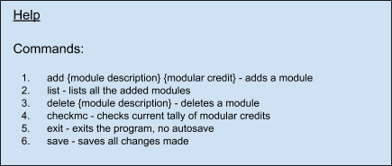
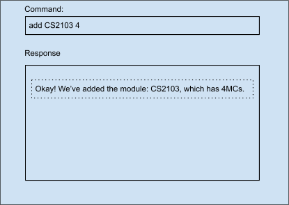
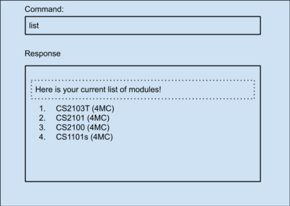
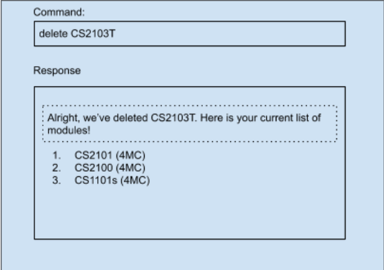
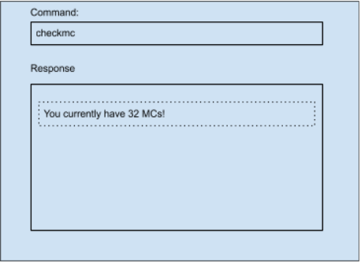
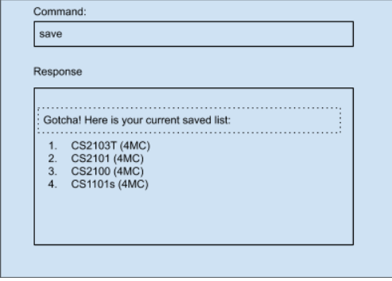
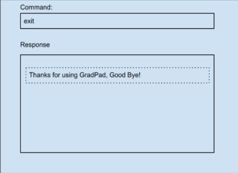

* Table of Contents
{:toc}

--------------------------------------------------------------------------------------------------------------------
## GradPad

GradPad is a one-stop solution to module management for Computer Science Undergraduates.
Planning for modules has always been a tedious process but it does not have to be. 

The current approach to planning and tracking graduation requirements is to open up tabs after tabs of NUS resources which can
be messy at times. So our team has come up with the idea of an easy-to-use, all-in-one application that 
can ease the process of module management for Computer Science Undergraduates.

GradPad is able to consolidate the modules you have taken and display the remaining required modules to 
ease your module planning process. A module searching platform is also included in GradPad, providing easy 
navigation of modules.

## Quick start

1. Ensure you have Java `11` or above installed in your Computer.

1. Download the latest `GradPad.jar` from [here](https://github.com/AY2021S1-CS2103T-T09-1/tp/releases).

1. Copy the file to the folder you want to use as the _home folder_ for your GradPad.

1. Double-click the file to start the app. The GUI similar to the below should appear in a few seconds. Note how the app contains some sample data. 
   

1. Type the command in the command box and press Enter to execute it. e.g. typing **`help`** and pressing Enter will open the help window. 
   Some example commands you can try:

   * **`list`** : Lists all added modules.

   * **`add`**`CS2103T 4` : Adds a module named `CS2103T` with `4` modular credits to the GradPad.

   * **`delete`**`CS2103T` : Deletes the module titled `CS2103T` in the current list.

   * **`exit`** : Exits the app.

1. Refer to the [Feature Summary List](#feature-summary-list) below for a summary of all commands.

--------------------------------------------------------------------------------------------------------------------

## Feature Summary List

1. Viewing Help

    * Allows user to view a list of all possible commands
    
1. Adding a module

    * Allows user to add any Module of choice into the `Current Modules` section for tracking purposes.
    
    * User can add any module by specifying their desired Module Code (eg. CS1231),
    Modular Credits (eg. 4), and Tags (eg. Core) along with the `add` command, in their
    input (more instructions below).
    
1. View added modules

    * Allows user to check all their added modules
    
1. Deleting a module

    * Allows a user to delete unwanted modules
    
1. Editing a module
    * Allows a user to edit the details of a module they have already added
    
1. Check modular credits (MCs)

    * Allows user to check their accumulated modular credit score
    
1. Exiting the program

    * Allows user to terminate the program
    
1. Saving the data

    * Allows users to save their current list of modules on their hard disk
    
    Refer to [features](#features) below for details on all commands.

## Features

**:information_source: Notes about the command format:** 

* Words in `UPPER_CASE` are the parameters to be supplied by the user. 
  e.g. in `add n/NAME`, `NAME` is a parameter which can be used as `add n/John Doe`.

* Items in square brackets are optional. 
  e.g `n/NAME [t/TAG]` can be used as `n/John Doe t/friend` or as `n/John Doe`.

* Items with `…`​ after them can be used multiple times including zero times. 
  e.g. `[t/TAG]…​` can be used as ` ` (i.e. 0 times), `t/friend`, `t/friend t/family` etc.

* Parameters can be in any order. 
  e.g. if the command specifies `n/NAME p/PHONE_NUMBER`, `p/PHONE_NUMBER n/NAME` is also acceptable.

### Viewing Help : `help`

Lists all possible commands and their functions.

Format: `help`

Example of usage: `help`

Expected outcome:

### Adding a Module : `add`

Adds a new module.

Format: `add c/ {module code} cr/ {modular credits}`

Example of usage: `add c/ CS2103T cr/ 4`

Expected outcome:

### View Added Modules : `list`

List all added modules.

Format: `list`

Example of usage: `list`

Expected outcome:

### Editing a Module: `edit`

Edits the module details of a module that has already been added to GradPad.

To choose the module that you want to edit, specify the index of that module in the Current Modules list.
You may also choose to edit more than one module detail in the same `edit` command.

**Note:** Editing the tag of a module does not add on to its existing tags. Rather, it replaces all 
existing tags with the new tags you're specifying.

Format: `edit {index} [c/module code] [cr/modular credits] [t/tag]...`

Example of usage: `edit 1 c/CS2103T cr/4 t/core-module t/required`

Expected outcome:

### Deleting a Module : `delete`

Removes a Module of choice from the Current Modules in GradPad.

Module code must be specified and module must exist in 
the Current Modules of Gradpad for successful deletion.

Format: `delete {module code}`

Example of usage: `delete CS2103T`

Expected outcome:

### Check Modular Credits : `checkmc`

Shows current amount of Modular Credits achieved.

Format: `checkmc`

Example of usage: `checkmc`

Expected outcome:

### Save : `save`

Saves all changes made.

Format: `save`

Example of usage: `save`

Expected outcome:

### Exit : `exit`

Exits the program. There is no auto-save upon exit.

Format: `exit`

Example of usage: `exit`

Expected outcome:

--------------------------------------------------------------------------------------------------------------------

## FAQ

**Q**: How do I transfer my data to another Computer? 
**A**: Install the app in the other computer and overwrite the empty data file it creates with the file that contains the data of your previous GradPad home folder.

--------------------------------------------------------------------------------------------------------------------

## Command summary

Action | Format, Examples
--------|------------------
**Add** | `add {module description} {modular credits}`   e.g. `add CS2100 4`
**Edit** | `edit {index} [c/module description] [cr/modular credits] [t/tags]`   e.g. `edit 1 c/CS2103T t/core`
**Delete** | `delete {module}`  e.g. `delete CS2103T`
**List** | `list`
**Check MCs** | `checkmc`
**Help** | `help`
**Exit** | `exit`
**Save** | `save`
