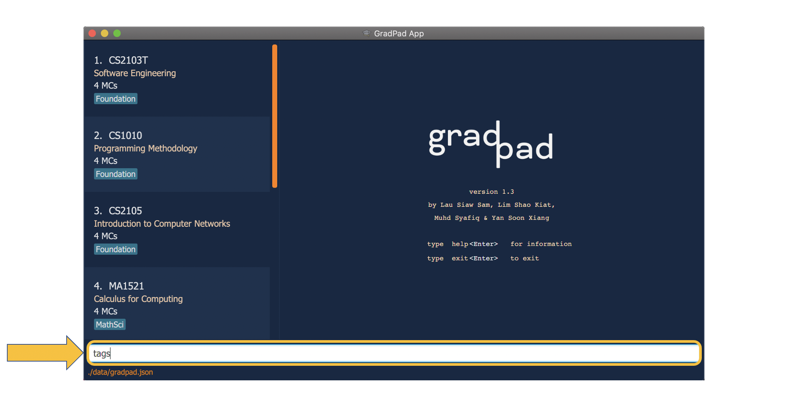
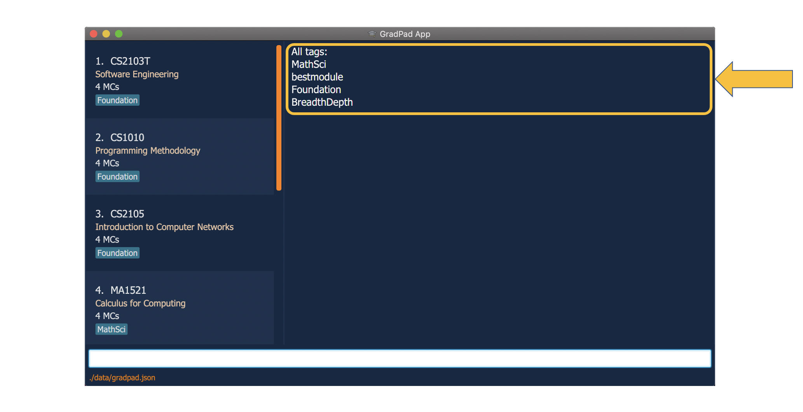

* Table of Contents
{:toc}

--------------------------------------------------------------------------------------------------------------------
## GradPad

We are a team of **Computer Science Undergraduates** working together to solve **module management** and **graduation planning** problems
faced by fellow Computer Science students. Below is the detailed User Guide for effective use of GradPad which can help you
ease and improve your **module planning process**.

GradPad is a one-stop solution to **module management** for Computer Science Undergraduates.
Planning for modules has always been a tedious process but it does not have to be.

The current approach to planning and tracking graduation requirements is to open up tabs after tabs of NUS resources such as 
[NUSMods](https://nusmods.com/) and [websites](https://www.comp.nus.edu.sg/programmes/ug/cs/curr/) of Faculty of Computing, 
which can be messy at times. 
So, our team has come up with the idea of an **easy-to-use**, **all-in-one application** that
can ease the process of **module management** for Computer Science Undergraduates.

GradPad **consolidates** the modules you have taken and **displays** the **remaining required modules** to
ease your module planning process. A **module searching platform** is also included in GradPad, providing easy
**navigation** of modules.

This user guide introduces what you can do with GradPad and the steps needed to do them. In addition,
it includes a **quick start guide** that walks you through the installation and set-up process.
With this guide, you'll be ready to use GradPad in no time.

--------------------------------------------------------------------------------------------------------------------
## NUSMods integration  

To streamline your module searching process with added convenience, GradPad integrates data from [NUSMods](https://nusmods.com/). With this, 
you no longer have to visit NUSMods separately to look up module information. Instead, GradPad offers you all that data 
in the same app you use to plan your modules itself.

We have requested and was granted permission from NUSMods to utilise their platform to retrieve data such as NUS course catalogue
and module information. These data are retrieved on the go in realtime, using the data provided by NUSMods.

--------------------------------------------------------------------------------------------------------------------

## Quick start

Follow the steps below to learn how to get started with GradPad!

1. Ensure you have Java `11` or above installed in your Computer.

1. Download the latest `GradPad.jar` from [here](https://github.com/AY2021S1-CS2103T-T09-1/tp/releases).

1. Copy the file to the folder you want to use as the _home folder_ for your GradPad.

1. Ensure you have **internet connectivity** to fully utilise GradPad with the latest data from [NUSMods](https://nusmods.com/).

1. Double-click the file to start the app. The GUI similar to the below should appear in a few seconds. Note how the app contains some sample data. 

   

1. Type the command in the command box and press Enter to execute it. e.g. typing **`help`** and pressing Enter will open the help window. 
   Some example commands you can try:

   * **`list`** : Lists all added modules.

   * **`add`** `CS2103T` : Adds a module named `CS2103T` to the GradPad.

   * **`delete`** `CS2103T` : Deletes the module titled `CS2103T` in the current list.
   
   * **`search`** : Search for a module from NUSMods database(if internet is available) or from local saved file.

   * **`exit`** : Exits the app.
   

**:information_source: Note:** 
Detailed explanation of each command can be found [here](#commands).

Refer to the [Feature Summary List](#feature-summary-list) below for a summary of all commands.

--------------------------------------------------------------------------------------------------------------------

## Feature Summary List
A consolidated view of GradPad feature list is listed below in a table form for easy reference.

 Features                         |    Description
 ----------------------------------------|------------
 Add a Module                            | Allows you to add any module of choice to the `Completed Modules` list for tracking purposes
 View Added Modules                      | Allows you to check all the modules you've added  to `Completed Modules`
 Find Modules from Completed Modules     | Allows you to look for modules in `Completed Modules` using keywords
 Delete a Module                         | Allows you to delete unwanted modules in `Completed Modules`
 Edit a Module                           | Allows you to edit the details of a module you've already added to `Completed Modules`
 Check Modular Credits                   | Allows you to check your current modular credit tally
 View all Required Modules               | Allows you to display all required modules in the Computer Science curriculum onto the `Result Display`
 View all General Education Modules      | Allows you to display all available General Education Modules offered in NUS, onto the `Result Display`
 View all Science Modules                | Allows you to display all viable Science modules in the Computer Science curriculum onto the `Result Display`
 Search for a Module                     | Allows you to search for any module available in NUS and display the module details in the `Result Display`
 Find Tags from Completed Modules        | Allows you to check all tags that are used in `Completed Modules`
 View Help                               | Allows you to view a list of all possible commands
 Exit the Program                        | Allows you to terminate the GradPad program

Refer to [Commands](#commands) below for details on all commands.

## Commands

Detailed explanations of each commands and their respective usage are listed under this section.

**:information_source: Notes about the Command Format and Feature Descriptions:** 

* When a command requires parameters, they can be entered in any order. 
For example, if the command specifies `add c/MODULE_CODE t/core`, `add t/core c/MODULE_CODE
` is also acceptable.

* Highlighted words (e.g. `this`) refer to actual commands or sections on the GradPad user interface.

### Adding a module: `add`

Scenario: 
You have just completed the CS2101 module, and you want to add the module into GradPad to track your academic progress. 
You found the module to be enjoyable so you would like to add tags to remind yourself of how fun the module was.

The `add` command allows you to add a module you have completed into the Completed Modules list.

You can add a module by specifying a valid module code. You can also include multiple tags using the prefix 't/' but they are optional.
Conveniently, you don't have to specify the module title or modular credits of the module you are adding - GradPad
automatically retrieves them for you using data from NUSMods.

**:information_source: Note:** 
You cannot add a module that has been previously added as GradPad does not allow duplicate modules.

To add the module:

1. Type `add cs2101 t/superbmodule t/superfun` into the command box, and press **Enter** to execute it. 

2. The result display box will display the message "New module added", along with the details of the module. You will then be able to see the CS2101 module at the bottom of the Completed Modules list.< 

### Viewing all added modules: `list`

Scenario: 
You have filtered the Completed Modules list to show modules whose module codes contain 'cs1', and you wish to restore the list to view all the modules you have added.

The `list` command allows you to view all the modules you have added into the Completed Modules list in GradPad using this command. This is especially useful when you have previously used a command that filters the list (i.e. `find`) and you wish to restore the list to its original state.

To view all modules:

1. Type `list` into the command box, and press **Enter** to execute it.

2. The result display box will display the message "Listed all modules", and you will be able to view all your previously added modules in the Completed Modules list.

### Viewing all added tags: `tags`

Scenario: 
You wish to filter your `Completed Modules` list to display modules tagged as "foundation". However, you've added
tons of tags to tons of modules and so you can't remember if this tag actually exists. 

The `tags` command allows you to view all the tags currently in your `Completed Modules` list in
 GradPad. This is useful when you want to see what tags you can filter your `Completed Modules` by (see the 
 `find` command below).

To view all tags:

1. Type `tags` into the command box, and press **Enter** to execute it.

2. The result display box will display the message "Listed all tags" followed by a list of all current tags.

### Editing module details: `edit`

Scenario: 
When you were a freshman, you added a module with tags "superbmodule" and "superfun". But now that you're graduating,
you actually think that the module was the best you'd taken in NUS.

The `edit` command allows you to edit the details of a module that you have added into GradPad.

You can edit a module by specifying the module code of the module in the Completed Modules list, followed by the
fields you wish to edit with their respective prefixes, 'c/' for module code, 't/' for tags. You may edit multiple fields in a
single `edit` command.

Module title and modular credits for respective module code will be automatically updated with data from NUSMods.
 
 

 
 **:information_source: Note:** 
* When you edit tags, instead of changing the descriptions of the existing tags, editing tags replaces
 them with new ones.

* Instead of deleting that module and adding it again with new tags, you can simply edit the module and replace the tags.
 
 
 

To edit the module:

1. Type `edit cs2101 t/bestModule` into the command box, and press **Enter** to execute it. 

2. The result display box will display the message "Edited module", along with the newly edited details of the module. You will also be able to see that the tags of the module displayed in the Completed Modules list has been replaced.

### Finding a specific module or a group of modules: `find`

Scenario: 
Let's say you have been adding a huge number of modules into GradPad, and you have lost track of the modules you 
have added. You want to check and see all CS-coded modules with the "core" tag.

The `find` command allows you to filter the Completed Modules list to display the modules that you want to see. 
You can do this by specifying parts of the module code of the module(s) you wish to display.
Additionally, you can also specify the tags of the module(s) you wish to display. When specifying tags however,
you must type out the entire tag and not just a part of it.

Instead of scrolling through the long Completed Modules list and checking the modules one by one, you can easily filter the list to display that module by `find`-ing said module.

To find the module:

1. Type `find cs core` into the command box, and press **Enter** to execute it. 

2. The result display box will display the message "1 modules listed!" and you will be able to see only the CS
-coded modules that have been tagged as "core" in the Completed Modules list.

### Deleting a Module: `delete`

Scenario: 
You have added several modules into GradPad but you realised that you accidentally added an additional module 'CS2107' that you have not completed yet. If you no longer want that module in your Completed Modules list, you can simply delete it.

The `delete` command allows you to remove a module you have added into GradPad.

You can delete a module by specifying the **module code** of the module. (Case insensitive)

To delete the module:

1. Type `delete cs2107` into the command box, and press **Enter** to execute it. 

2. The result display will display the message "Deleted Module" along with the details of the module you deleted.

3. You can then confirm that the module no longer exists in the Completed Modules list by `find`-ing the module Type `find cs2107` into the command box, and press **Enter** to execute it. You will see that you can no longer `find` the module in the Completed Modules list. 

### Checking total modular credits: `checkmc`

**Note:** A **Modular Credit** (MC) is a unit of the effort, stated in terms of time, expected of a typical student in managing his/her workload, with
an average of 20 MCs per semester.

Scenario: 
You want to make sure you have hit the minimum criteria of 70MCs required for applying internship modules or the 160MCs graduation requirements.

The `checkmc` allows you to check the total amount of modular credits you have accumulated so far using this command.
This gives you a rough gauge of the progress of your graduation planning.

To check total modular credits:

1. Type `checkmc` into the command box, and press **Enter** to execute it.

2. The result display box will display the message "Total MC has been calculated" along with your total modular credits amount.

### Checking required modules: `required`

Scenario:  
You have added several modules into your GradPad so far but you are unsure if they are part of the Computer Science curriculum. You can simply check by using the `required` command.

The `required` command allows you to check the modules of the Computer Science curriculum you have yet to take, based on your `Completed Modules` list.

To check required modules:

1. Type `required` into the command box, press **Enter** to execute it.

2. The result display box will then display all the modules you have yet to take for each particular field, as shown below.

### Checking General Education Modules: `gem`

Scenario:  
You wish to take some GE modules to clear your GE requirement, but you are unsure what modules are available. You can simply check by using the `gem` command.

The `gem` command allows you to check all the available General Education (GE) modules that are available in NUS. To ease your planning, the `gem` command indicates which modules are available in Semester 1 and/or 2.

To check GE modules:

1. Type `gem` into the command box, press **Enter** to execute it.

2. The result display box will then display all the available GE modules that you can take, categorised into Semester 1 and 2, as shown below.

### Checking Science modules: `science`

Scenario:  
You wish to take a Science module to clear your Science requirement, but you forgot what modules are available. You can simply check by using the `science` command.

The `science` command allows you to check all the available Science modules of the Computer Science curriculum.

To check Science modules:

1. Type `science` into the command box, press **Enter** to execute it.

2. The result display box will then display all the available Science modules that you can take, as shown below.

### Searching for a module: `search`

Scenario:  
After viewing the required modules you have yet to take, you wish to find out more about those modules (Eg. What are they about? 
Do they have any pre-requisites?). You can simply look up those details by using the `search` command.

The `search` command allows you to search for any module available in NUS.

You can search for a module by specifying the module code of the module. The essential module details will then be retrieved 
from NUSMods database directly and displayed in the result display box.

**:information_source: Note:** 
If your internet is down, you can only search for modules that are of the Computer Science curriculum.

1. Type `search MA1521` into the command box, press **Enter** to execute it.

2. The result display box will then display all the relevant information about the module "MA1521", as shown below.

### Showing the help display: `help`

Scenario:  
You are in the midst of planing your modules, but you suddenly forgot what commands are available to you. Simply refresh your memory by using the `help` command to see all available commands and their respective functions.

The `help` command displays all of GradPad's available commands and how to use them, to you. This command is useful for first-timers or users who generally do not know how to use GradPad.

To show the help display:

1. Type `help` into the command box, and press **Enter** to execute it. 

1. The result display box will display all of GradPad's commands along with examples on how to use them. 

### Exiting GradPad: `exit`

Besides clicking the "close" button (red button) at the top of the GradPad window, you can exit GradPad using the `exit` command.

To exit:

1. Type `exit` into the command box, and press **Enter** to execute it. 

2. The result display box will display the message "Exiting GradPad as requested ..." and after a 1.5 second delay, the application will terminate. 

--------------------------------------------------------------------------------------------------------------------

## FAQ

**Q**: How do I transfer my data to another Computer? 
**A**: Install the app in the other computer and overwrite the empty data file it creates with the file that contains the data of your previous GradPad home folder.

--------------------------------------------------------------------------------------------------------------------

## Command summary

This section is the table of all the commands available and their respective usage example in GradPad.

Action | Format | Example
--------|-------|----------
**Add** | `add {module code}` | `add CS2100`
**Edit** | `edit {module code} [c/module code] [t/tags]` | `edit cs2103 c/CS2103T t/core`
**Delete** | `delete {module code}` | `delete CS2103T`
**Completed Modules** | `list`
**Find** | `find {module code or tag}` | `find CS2103T foundation fun`
**Check MCs** | `checkmc`
**Required Modules** | `required`
**General Education Modules** | `gem`
**Science Modules** | `science`
**Search module details** | `search {module code}` | `search CS2103T`
**Check existing Tags** | `tags`
**Help** | `help`
**Exit** | `exit`
