* Table of Contents
{:toc}

--------------------------------------------------------------------------------------------------------------------
## GradPad

GradPad is a one-stop solution to module management for Computer Science Undergraduates.
Planning for modules has always been a tedious process but it does not have to be.

The current approach to planning and tracking graduation requirements is to open up tabs after tabs of NUS resources which can
be messy at times. So, our team has come up with the idea of an easy-to-use, all-in-one application that
can ease the process of module management for Computer Science Undergraduates.

GradPad consolidates the modules you have taken and displays the remaining required modules to
ease your module planning process. A module searching platform is also included in GradPad, providing easy
navigation of modules.

This user guide introduces what you can do with GradPad and the steps needed to do them. In addition,
it includes a quick start guide that walks you through the installation and set-up process.
With this guide, you'll be ready to use GradPad in no time.

--------------------------------------------------------------------------------------------------------------------

## Quick start

1. Ensure you have Java `11` or above installed in your Computer.

1. Download the latest `GradPad.jar` from [here](https://github.com/AY2021S1-CS2103T-T09-1/tp/releases).

1. Copy the file to the folder you want to use as the _home folder_ for your GradPad.

1. Double-click the file to start the app. The GUI similar to the below should appear in a few seconds. Note how the app contains some sample data. 
   

1. Type the command in the command box and press Enter to execute it. e.g. typing **`help`** and pressing Enter will open the help window. 
   Some example commands you can try:

   * **`list`** : Lists all added modules.

   * **`add`** `CS2103T 4` : Adds a module named `CS2103T` with `4` modular credits to the GradPad.

   * **`delete`** `CS2103T` : Deletes the module titled `CS2103T` in the current list.

   * **`exit`** : Exits the app.

1. Refer to the [Feature Summary List](#feature-summary-list) below for a summary of all commands.

--------------------------------------------------------------------------------------------------------------------

## Feature Summary List

 Features                         |    Description
 ----------------------------------------|------------
 View Help                               | Allows you to view a list of all possible commands
 Add a Module                            | Allows you to add any module of choice to the `Completed Modules` list for tracking purposes
 View Added Modules                      | Allows you to check all the modules you've added  to `Completed Modules`
 Find Modules from Completed Modules     | Allows you to look for modules in `Completed Modules` using keywords
 Delete a Module                         | Allows you to delete unwanted modules in `Completed Modules`
 Edit a Module                           | Allows you to edit the details of a module you've already added to `Completed Modules`
 Check Modular Credits                   | Allows you to check your current modular credit tally
 View All Required Modules               | Allows you to display all required modules in the Computer Science curriculum onto the `Result Display`
 Search for a Required Module            | Allows you to search for a required module and display the module details in the `Result Display`
 Exit the Program                        | Allows you to terminate the GradPad program

Refer to [Commands](#commands) below for details on all commands.

## Commands

**:information_source: Notes about the Command Format and Feature Descriptions:** 

* When a command requires parameters, they can be entered in any order. 
For example, if the command specifies `add c/MODULE_CODE cr/MODULAR_CREDITS`, `add cr/MODULAR_CREDITS c/MODULE_CODE` is also acceptable.

* Highlighted words (e.g. `this`) refer to actual commands or sections on the GradPad user interface.

### Showing the help display: `help`

The `help` command displays all of GradPad's available commands and how to use them, to you. This command is useful for first-timers or users who generally do not know how to use GradPad.

To show the help display:

1. Type `help` into the command box, and press **Enter** to execute it. 
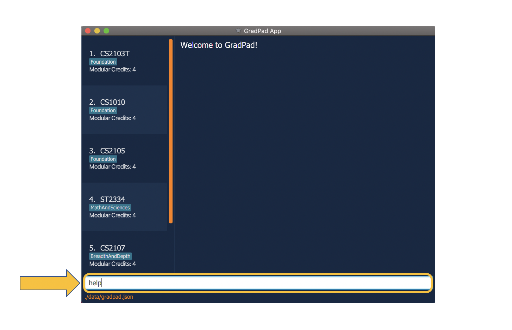

1. The result display box will display all of GradPad's commands along with examples on how to use them. 
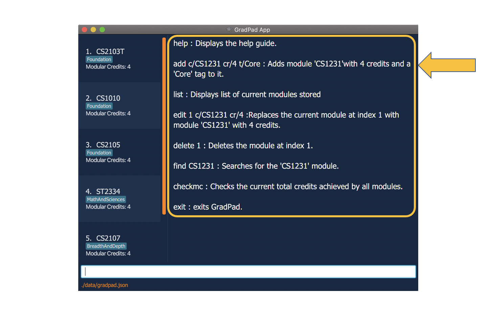

### Adding a module: `add`

This command allows you to add a module you have completed into the Completed Modules list.

You can add a module by specifying a valid module code as well as the modular credits the module carries using the prefixes 'c/' and 'cr/' respectively. You can also include multiple tags using the prefix 't/' but they are optional.

**Note:** You cannot add a module that has been previously added as GradPad does not allow duplicate modules.

Example: 
You have just completed the CS2101 module and you want to add the module into GradPad to track your academic progress. You found the module to be enjoyable so you would like to add tags to remind yourself of how fun the module was.

To add the module:

1. Type `add c/cs2101 cr/4 t/superbmodule t/superfun` into the command box, and press **Enter** to execute it. 

2. The result display box will display the message "New module added", along with the details of the module. You will then be able to see the CS2101 module at the bottom of the Completed Modules list.< 
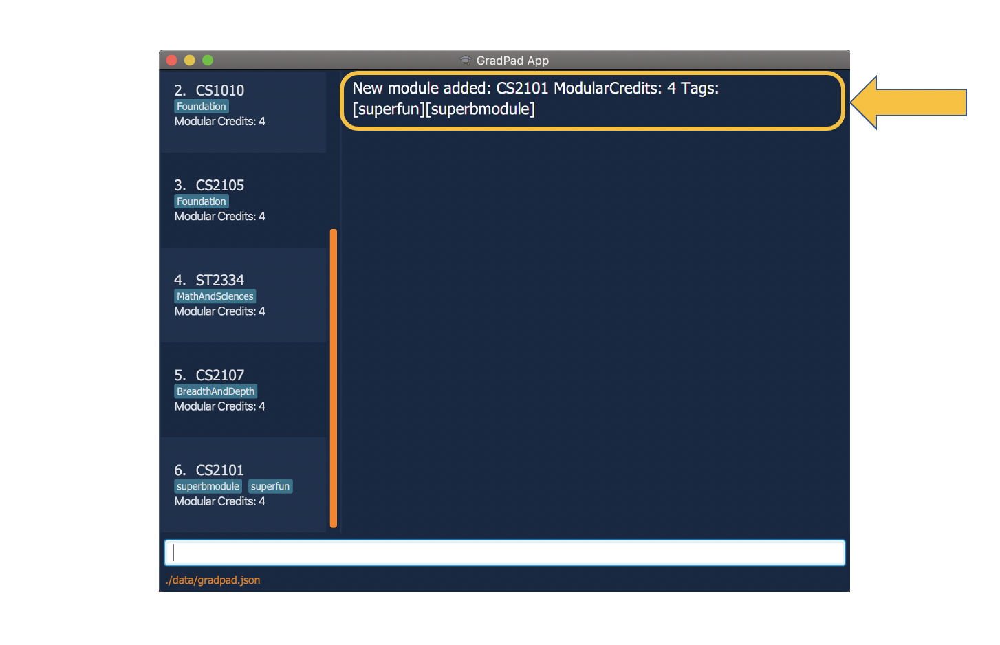

### Viewing all added modules: `list`

You can view all the modules you have added into the Completed Modules list in GradPad using this command. This is especially useful when you have previously used a command that filters the list (i.e. `find`) and you wish to restore the list to its original state.

Example: 
You have filtered the Completed Modules list to show modules whose module codes contain 'cs1', and you wish to restore the list to view all the modules you have added.

To view all modules:

1. Type `list` into the command box, and press **Enter** to execute it.
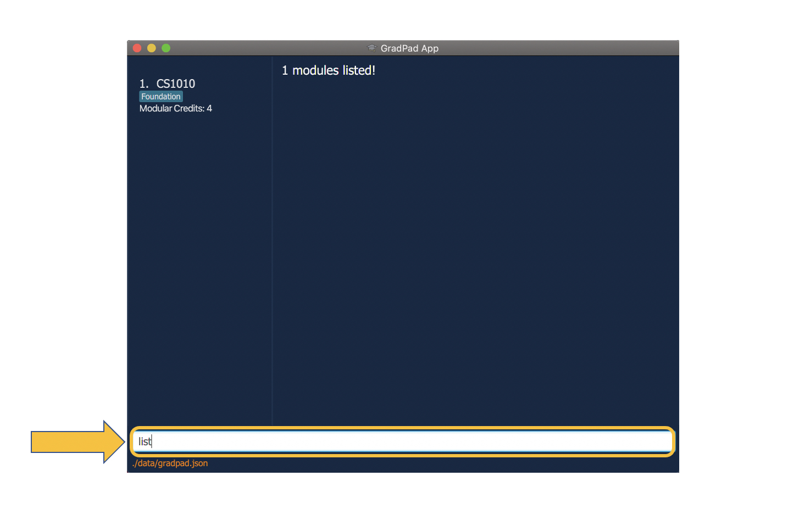

2. The result display box will display the message "Listed all modules" and you will be able to view all your previously added modules in the Completed Modules list.
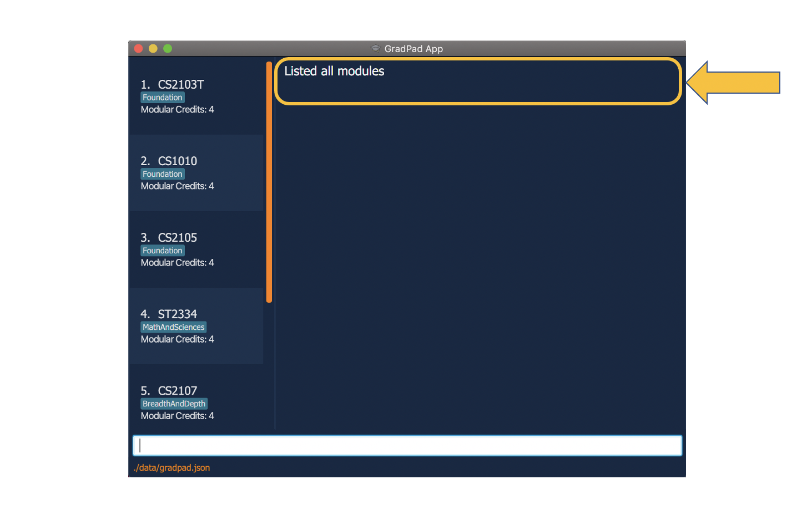

### Editing module details: `edit`

This command allows you to edit the details of a module that you have added into GradPad.

You can edit a module by specifying the index of the module in the Completed Modules list, followed by the fields you wish to edit with their respective prefixes, 'c/' for module code, 'cr/' for modular credits, etc. You may edit multiple fields in a single `edit` command.

**Note:** You can also edit tags, however, instead of changing the descriptions of the existing tags, editing tags replace them with new ones.

Example: 
You have accidentally added a module with tags "superbmodule" and "superfun" when you actually found that module to be extremely boring and draggy.

Instead of deleting that module and adding it again with new tags, you can simply edit the module and replace the tags. The index of the module in the Completed Modules list is 6.

To edit the module:

1. Type `edit 6 t/boring` into the command box, and press **Enter** to execute it. 
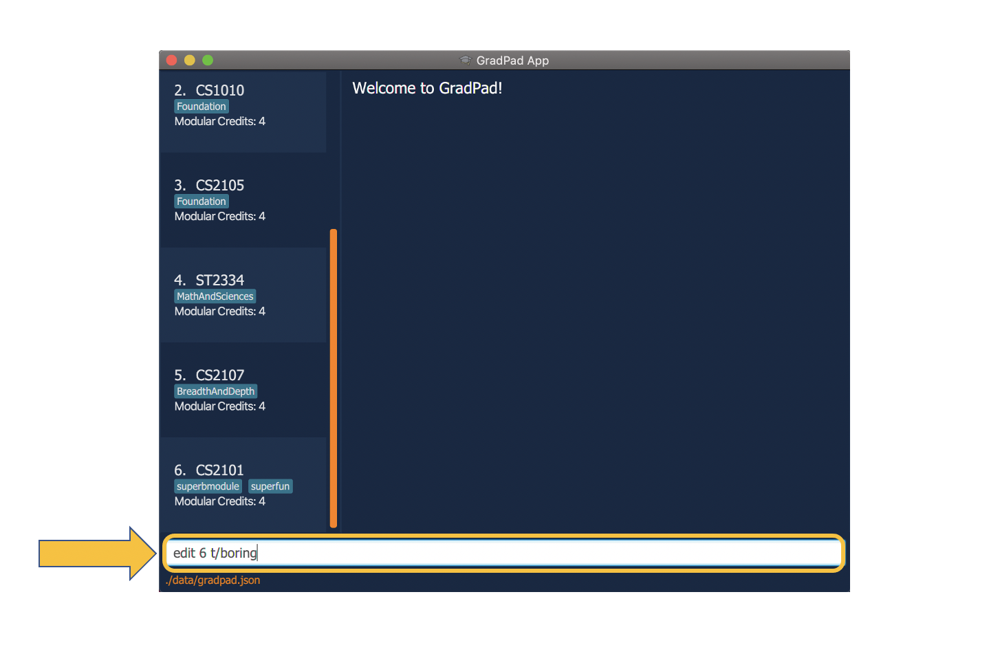

2. The result display box will display the message "Edited module", along with the newly edited details of the module. You will also be able to see that the tags of the module displayed in the Completed Modules list has been replaced.
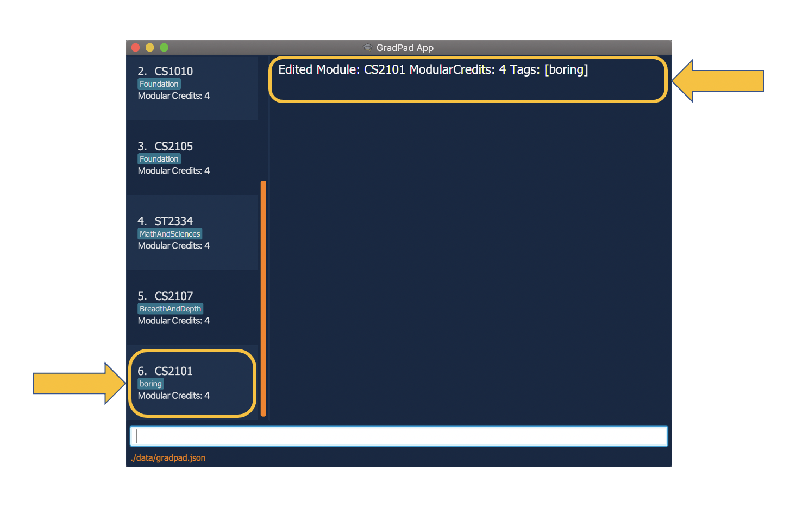

### Finding a specific module or a group of modules: `find`

The `find` command allows you to filter the Completed Modules list to display the modules that you want to see. You can do this by specifying parts of the module code of the module(s) you wish to display.

Example: 
Let's say you have been adding a huge number of modules into GradPad, and you have lost track of the modules you have added. You want to check and confirm that you have added the module 'CS2101'.

Instead of scrolling through the long Completed Modules list and checking the modules one by one, you can easily filter the list to display that module by `find`-ing said module.

To find the module:

1. Type `find cs2101` into the command box, and press **Enter** to execute it. 

2. The result display box will display the message "1 modules listed!" and you will be able to see only the CS2101 module in the Completed Modules list.
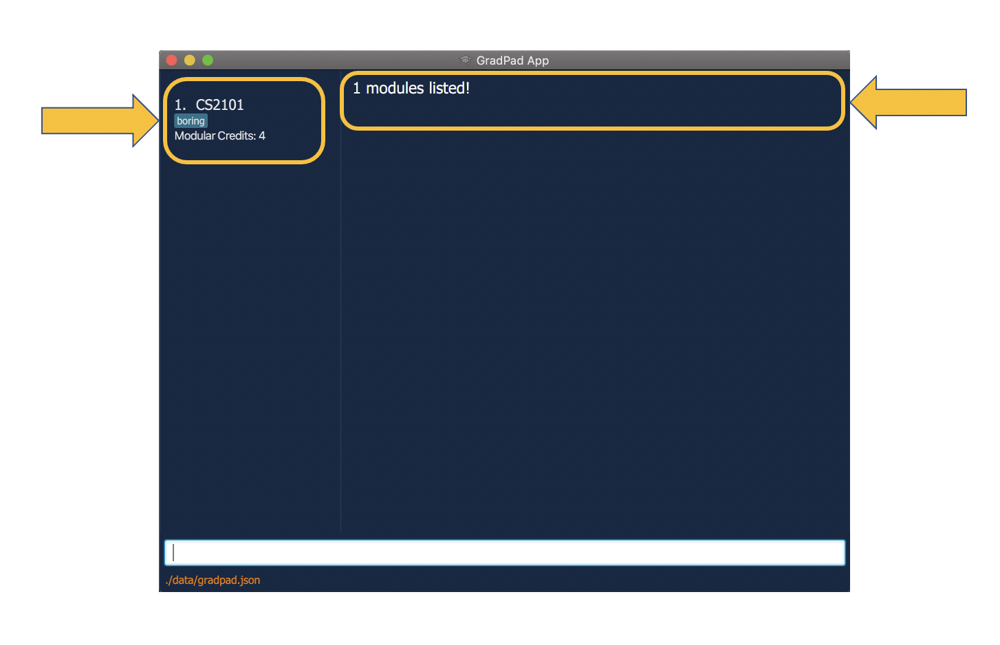

### Deleting a Module: `delete`

This command allows you to remove a module you have added into GradPad.

You can delete a module by specifying the module code of the module.

Example: 
You have added several modules into GradPad but you realised that you accidentally added an additional module 'CS2107' that you have not completed yet. If you no longer want that module in your Completed Modules list, you can simply delete it.

To delete the module:

1. Type `delete cs2107` into the command box, and press **Enter** to execute it. 
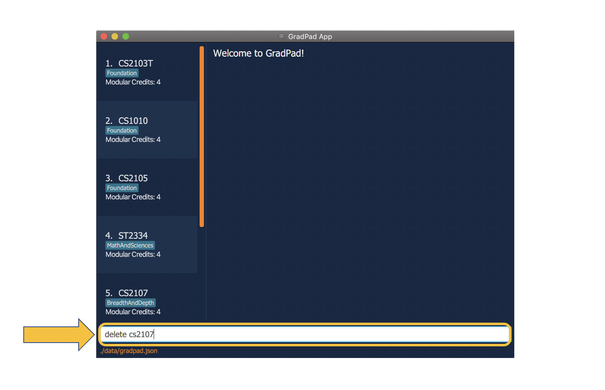

2. The result display will display the message "Deleted Module" along with the details of the module you deleted.
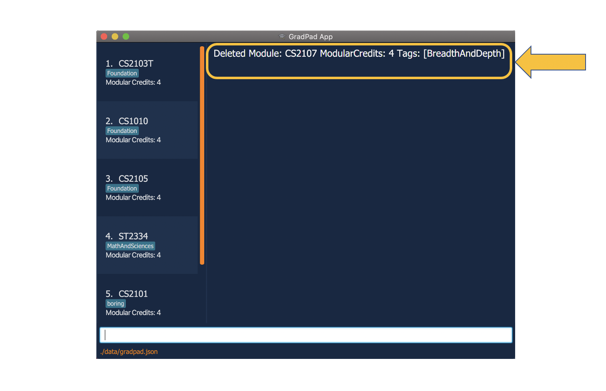

3. You can then confirm that the module no longer exists in the Completed Modules list by `find`-ing the module Type `find cs2107` into the command box, and press **Enter** to execute it. You will see that you can no longer `find` the module in the Completed Modules list. 
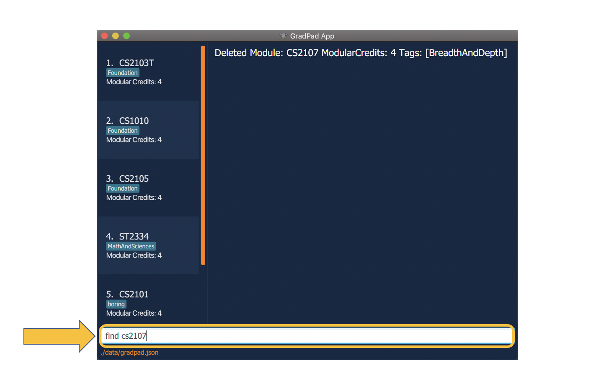
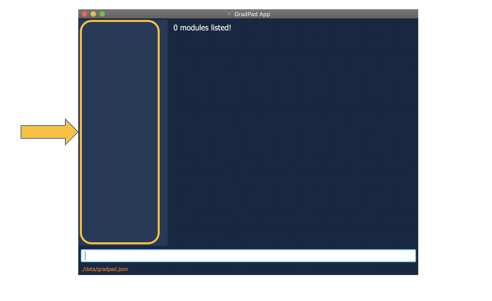

### Checking total modular credits: `checkmc`

You can check the total amount of modular credits you have accumulated so far using this command.

To check total modular credits:

1. Type `checkmc` into the command box, and press **Enter** to execute it.

2. The result display box will display the message "Total MC has been calculated" along with your total modular credits amount.

### Exiting GradPad: `exit`

Besides clicking the "close" button (red button) at the top of the GradPad window, you can exit GradPad using the `exit` command.

To exit:

1. Type `exit` into the command box, and press **Enter** to execute it. 
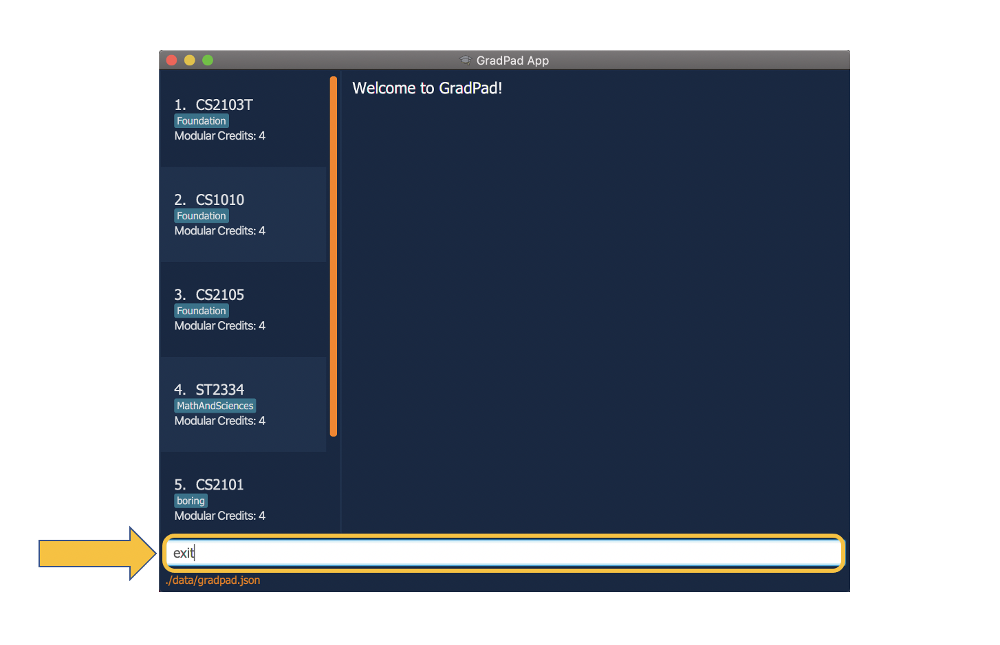

2. The result display box will display the message "Exiting GradPad as requested ..." and after a 1.5 second delay, the application will terminate. 
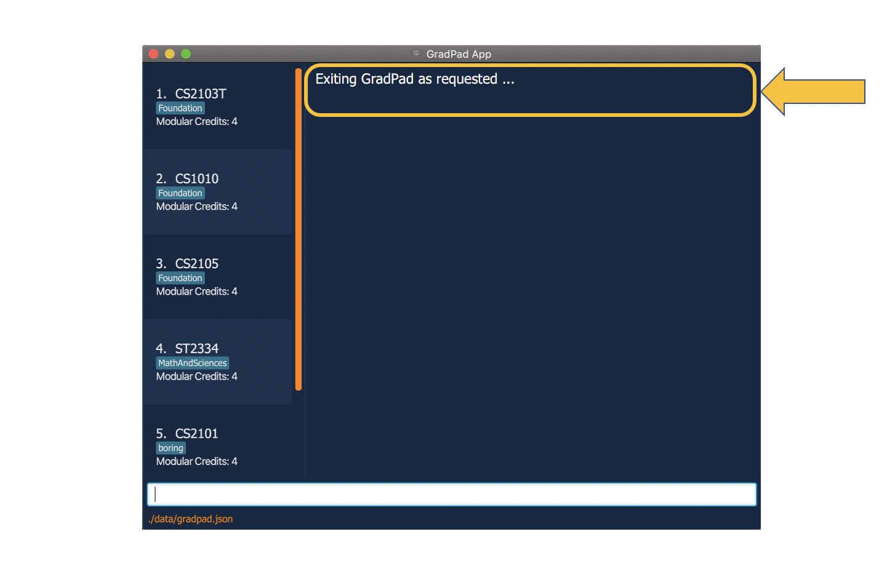

--------------------------------------------------------------------------------------------------------------------

## FAQ

**Q**: How do I transfer my data to another Computer? 
**A**: Install the app in the other computer and overwrite the empty data file it creates with the file that contains the data of your previous GradPad home folder.

--------------------------------------------------------------------------------------------------------------------

## Command summary

Action | Format | Example
--------|-------|----------
**Help** | `help`
**Add** | `add c/ {module code} cr/ {modular credits}` | `add c/CS2100 cr/4`
**Edit** | `edit {index} [c/module code] [cr/modular credits] [t/tags]` | `edit 1 c/CS2103T t/core`
**Delete** | `delete {module code}` | `delete CS2103T`
**Completed Modules** | `list`
**Find** | `find {module code}` | `find CS2103T`
**Check MCs** | `checkmc`
**Required Modules** | `required`
**Search module details** | `search {module code}` | `search CS2103T`
**Exit** | `exit`
