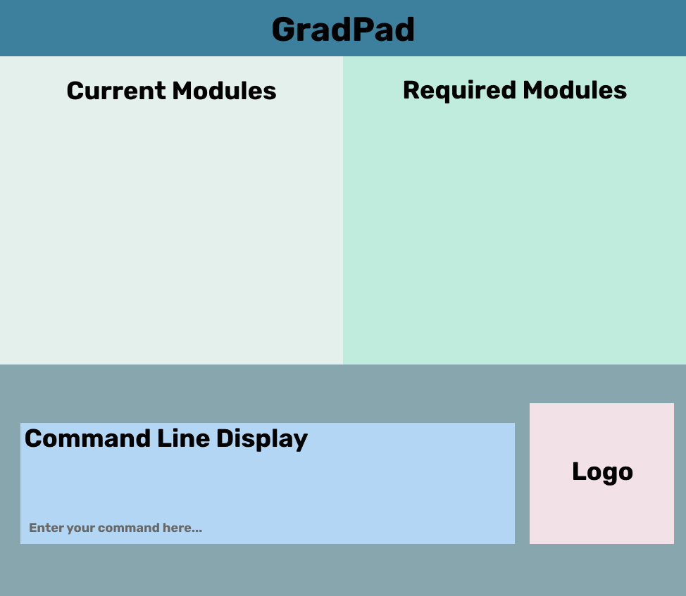

**GradPad is a desktop application for managing your NUS modules.** While it has a GUI, most of the user interactions happen using a CLI (Command Line Interface).

GradPad is a one-stop solution to **module management** for Computer Science Undergraduates.
Planning for modules has always been a tedious process but it does not have to be.

GradPad **consolidates** the modules you have taken and **displays** the remaining required modules to
ease your module planning process. A **module searching platform** is also included in GradPad, providing easy
**navigation** of modules.

* If you are interested in using GradPad, head over to the [_Quick Start_ section of the **User Guide**](UserGuide.html#quick-start).
* If you are interested about developing GradPad, the [**Developer Guide**](DeveloperGuide.html) is a good place to start.

**Acknowledgements**

* Libraries used: [JavaFX](https://openjfx.io/), [Jackson](https://github.com/FasterXML/jackson), [JUnit5](https://github.com/junit-team/junit5)
